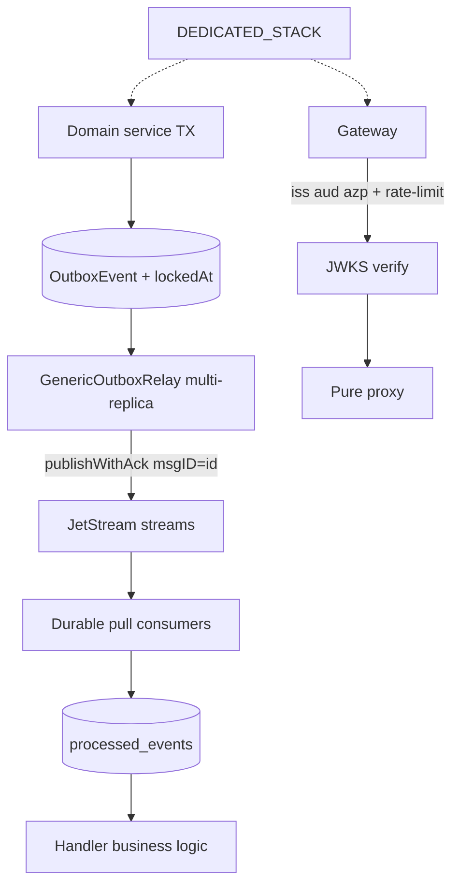
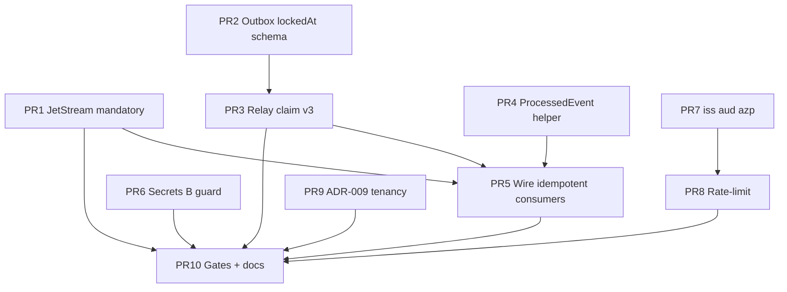

# Enterprise 0.1 — Platform Certification Design (Q0)

| Field | Value |
|-------|--------|
| **Document** | `docs/ENTERPRISE-0.1-PLATFORM-DESIGN.md` |
| **Milestone** | Q0 — Platform Certification |
| **Tag** | `enterprise-0.1-platform` |
| **Branch** | `enterprise-0.1-platform` |
| **Baseline** | `pilot-v1.1.0` (Pilot COMPLETE) |
| **Author** | Principal Architect (Enterprise 2.0 automation) |
| **Date** | 2026-08-02 |
| **Status** | **Approved for IMPLEMENT** |
| **Tenancy lock** | `DEDICATED_STACK` (STATUS; not SHARED_RLS) |
| **Secrets** | Variant **B** (`APPROVED_BY_USER_A=false`) |
| **Non-negotiables** | ADR-008 + `docs/ENTERPRISE-2.0-PLAN.md` |

---

## Overview

Pilot v1 COMPLETE delivered a single-tenant-per-deployment pilot with transactional outbox, JetStream **opt-in**, auth default ON, and honest live gates (`smoke:pilot`). **Q0 does not expand domain features.** It certifies the platform so that enterprise tags cannot silently degrade to demo shortcuts:

| Gap after Pilot | Enterprise requirement |
|-----------------|------------------------|
| `NATS_JETSTREAM` opt-in; core NATS still default | JetStream **mandatory** on enterprise profiles |
| Outbox reclaim uses `createdAt`; single-replica contract | `lockedAt` + multi-replica-safe claim |
| Idempotency ad-hoc (e.g. reverse WIP only) | Durable `processed_events` on money/stock/saga consumers |
| Variant B documented | Enforce + rotate ops path; block Variant A without approval |
| `iss` defaulted; `aud` optional; no `azp`; JWKS rateLimit only | Hard `iss`/`aud`/`azp` + gateway HTTP rate-limit |
| Single-tenant contract | ADR + enforcement sketch for DEDICATED_STACK |

**Goal:** Ship tag `enterprise-0.1-platform` with gates green under **live** chaos (outbox hard, saga compensation, no-secrets, baselines, decimal money). No readiness theater. No Faza 29+.

---

## Background & motivation

### What Pilot already proved (do not re-build)

- Auth default ON; JWKS pilot; pure proxy gateway; public surface shrink (PR 1–3, 17).
- Outbox schema `PROCESSING` + attempts; GenericOutboxRelay v2; TX writes core producers (PR 4–9).
- JetStream kernel, stream bootstrap, single-consumer path for fin-wip + inv-eto when flag on (PR 13–14).
- Tenant extension + worker ALS; single-tenant contract (PR 15).
- G-lite saga + reverse WIP harden (PR 16).
- Decimal blocklist + baselines + DR drill + smoke:pilot (PR 10–11, 19–20).
- Secrets working tree clean; Variant B policy (PR 1, `docs/SECURITY-SECRETS-VARIANT-B.md`).

### Residual that blocks enterprise certification

From `GenericOutboxRelay` residual note and TD registry:

1. **TD-JS residual:** Flag default **off** → enterprise path can still run core NATS only.
2. **Outbox multi-replica:** No `lockedAt`/`processingStartedAt` → reclaim can double-deliver under multi-instance relay (`docs/SINGLE-TENANT-CONTRACT.md` still requires single replica).
3. **Consumer idempotency:** JetStream `msgID` de-dupe window is short (2m); no durable consumer-side ledger → double delivery after reclaim/replay is unsafe for money/stock.
4. **Auth residual:** `JWT_AUDIENCE` optional; no authorized-party (`azp`) pin; no gateway request rate-limit beyond jwks-rsa client rateLimit.
5. **Tenancy residual:** Product contract is pilot single-tenant; enterprise needs ADR + STATUS-locked DEDICATED_STACK enforcement sketch (no SHARED_RLS code path until STATUS changes).

---

## Goals & non-goals

### Goals (Q0 workstreams)

| ID | Goal |
|----|------|
| **E0.1** | JetStream mandatory on enterprise profile; fail-closed if core-NATS-only in prod/enterprise |
| **E0.2** | Outbox `lockedAt` (or equivalent) + claim algorithm multi-replica safe |
| **E0.3** | Idempotent consumers via `processed_events` (durable event ledger) |
| **E0.4** | Secrets Variant B operationalized; Variant A hard-blocked without `APPROVED_BY_USER_A` |
| **E0.5** | Auth: hard `iss` + `aud` + `azp`; gateway rate-limit on auth boundary |
| **E0.6** | Tenancy ADR + enforcement sketch for DEDICATED_STACK |

### Non-goals

- Domain feature expansion (ETO depth, finance full, KSeF prod, Temporal workers) — **Q1+**
- SHARED_RLS multi-tenant product — only if STATUS `tenancy: SHARED_RLS`
- Git history rewrite (Variant A / filter-repo) — only if `APPROVED_BY_USER_A=true`
- Force-push master; readiness theater; Faza 29+ pipelines
- NATS 3-node HA cluster (Q3); NetworkPolicy mesh (Q3)

---

## Current state vs target

| Dimension | Pilot v1.1.0 | Enterprise 0.1 (Q0) |
|-----------|--------------|---------------------|
| JetStream | Opt-in `NATS_JETSTREAM` | **Mandatory** when `ENTERPRISE=1` / `PILOT=1` enterprise profile; compose + boot scripts default on |
| Outbox claim | Conditional PENDING→PROCESSING; reclaim by `createdAt` | `lockedAt` set on claim; reclaim only expired locks; safe multi-replica |
| Consumers | Partial idempotency (reverse WIP) | `ProcessedEvent` table + helper; money/stock/saga handlers |
| Secrets | Tree clean + Variant B doc | CI + runbook; no filter-repo; rotation checklist |
| Auth | iss default Keycloak; aud optional | Required iss; required aud; required azp allowlist; HTTP rate-limit |
| Tenancy | Single-tenant contract | ADR-009 + STATUS lock + deploy sketch (one stack per org) |
| Replica policy | Single outbox relay replica | Multi-replica **allowed** after E0.2+E0.3 |
| Gates | smoke:pilot (+ optional JS) | Q0 gate_commands live strict + outbox hard + saga + ci-no-secrets |

### Target architecture (messaging + claim)



---

## Workstream design

### E0.1 — JetStream mandatory (no core-NATS prod path)

**Problem:** `isJetStreamEnabled()` defaults false. Enterprise can boot with Nest core NATS only → at-most-once, no durable consumer, dual-path ambiguity.

**Decision KD-E0.1:**  
Introduce **profile resolver** in shared-kernel:

| Env | Behavior |
|-----|----------|
| `ENTERPRISE=1` or `ENTERPRISE_PROFILE=true` | JetStream **required**; process fail-fast at bootstrap if flag off or streams missing |
| `PILOT=1` (enterprise boot scripts) | Same as enterprise for messaging (align with `boot-pilot-complete` / compose pilot) |
| Dev local without flags | Core NATS still allowed (developer convenience) |

Implementation sketch:

1. `requireJetStreamForEnterprise(env)` — throws/logs fatal if enterprise profile && !isJetStreamEnabled.
2. Compose pilot / enterprise env files: `NATS_JETSTREAM=true`, `ENTERPRISE=1`.
3. Gate: existing `smoke:pilot:js` becomes **non-skippable** under enterprise (`SKIP_JS` ignored when `ENTERPRISE=1`).
4. Document: dual Nest+JS subscribe remains **forbidden** (already `preferJetStreamConsumerPath` / `nestEventPatternDisabled`).

**Alternatives rejected:**

| Alt | Why reject |
|-----|------------|
| Keep opt-in forever | Violates ADR-008 #2 |
| Remove core NATS code entirely | Breaks local unit tests without NATS JS; keep as non-enterprise fallback |
| Kafka migration | Out of scope; ADR-002 stands |

**Acceptance:**

- With `ENTERPRISE=1` and `NATS_JETSTREAM` unset/false → service or gate fails closed.
- Live ETO path uses durable consumers; `REQUIRE_LIVE` smoke green with JS on.

---

### E0.2 — Outbox `lockedAt` + multi-replica safe

**Problem:** Claim is optimistic PENDING→PROCESSING but reclaim uses `createdAt`, so a long-running publish can be reclaimed by another replica → double publish (mitigated only by JetStream msgID window + single-replica ops rule).

**Decision KD-E0.2:**

Add to all producer `OutboxEvent` models (migration per service):

```prisma
lockedAt   DateTime?
lockedBy   String?   // optional: hostname:pid or relay instance id
```

**Claim algorithm (v3):**

1. **Reclaim:** `PROCESSING` AND (`lockedAt` IS NULL OR `lockedAt < now - RECLAIM_MS`) → set `status=PENDING`, clear lock (or directly re-claim).
2. **Claim batch:** Select PENDING ordered by createdAt LIMIT N **FOR UPDATE SKIP LOCKED** where supported; else conditional `updateMany` with `status=PENDING` guard **and** set `lockedAt=now()`, `lockedBy=instanceId`, `status=PROCESSING`.
3. **Publish** await ack (JetStream).
4. **Complete:** `PROCESSED` + `processedAt`; clear lock.
5. **Failure:** attempts++; if max → FAILED else PENDING + clear lock (or keep lock until reclaim).

**Postgres note:** Prisma does not expose SKIP LOCKED natively on all paths — prefer:

- `UPDATE ... SET status='PROCESSING', lockedAt=now() WHERE id=$1 AND status='PENDING' RETURNING *` via `$executeRaw` / `$queryRaw` in shared-kernel helper, **or**
- keep updateMany-per-id with version/lock guard (good enough if lockedAt reclaim is correct).

**Alternatives rejected:**

| Alt | Why reject |
|-----|------------|
| Only set `OUTBOX_RECLAIM_MINUTES=0` | Hides stuck messages; not multi-replica safe |
| External lease store (Redis) | Extra dep; Postgres is already source of truth |
| Single-replica forever | Blocks enterprise scale; Q0 must unlock multi-replica |

**Acceptance:**

- Two relay processes on same DB: no double PROCESSED without idempotent consumer protection; live `smoke-outbox-live-hard` green.
- Update `docs/SINGLE-TENANT-CONTRACT.md`: multi-replica OK when lockedAt + processed_events present.

---

### E0.3 — Idempotent consumers `processed_events`

**Problem:** At-least-once delivery (JS redelivery, outbox double-publish outside de-dupe window) can double-apply money/stock/saga side effects.

**Decision KD-E0.3:**

Shared pattern (per consumer service DB — ADR-003 database-per-service):

```prisma
model ProcessedEvent {
  eventId     String   @id  // Nats-Msg-Id / outbox id / envelope eventId
  consumer    String   // durable or handler name
  processedAt DateTime @default(now())
  // optional: subject, tenantId for ops
  @@index([consumer, processedAt])
}
```

**Helper** in shared-kernel: `withProcessedEventGuard(prisma, { eventId, consumer }, fn)`:

1. If row exists → return `{ idempotent: true }` (skip business body).
2. Else run `fn` inside TX; insert ProcessedEvent same TX (unique violation → treat as idempotent).

**Mandatory adoption (Q0):**

| Service | Handlers |
|---------|----------|
| finance | WIP record/reverse, production→journal paths |
| inv-service | reservation / ETO inv consumers |
| pm / plm / mes | any mutation-on-event in pilot spine |
| analytics | saga compensation triggers if they mutate state |

**Envelope rule:** Publishers already set JetStream `msgID = outbox.id`. Consumers must prefer `msgID` / `Nats-Msg-Id` / payload `eventId` / outbox id — never regenerate.

**Alternatives rejected:**

| Alt | Why reject |
|-----|------------|
| Rely only on JetStream duplicate_window | 2 minutes insufficient for crash recovery |
| Global shared processed_events DB | Violates ADR-003 |
| Business-key only (projectId+type) | Incomplete; keep as secondary where already present (reverse WIP) |

**Acceptance:**

- Re-deliver same msgID → no second journal line / stock mutation.
- Unit tests on helper + at least one live path under outbox hard smoke.

---

### E0.4 — Secrets Variant B

**Problem:** Variant B is documented; automation must not run filter-repo; rotations must be explicit ops.

**Decision KD-E0.4:**

1. **Default remains Variant B** while `APPROVED_BY_USER_A=false` in STATUS.
2. CI: `scripts/ci-no-secrets.sh` already in Q0 gates — keep fail-closed.
3. Add guard script or gate step: **refuse** any automation that invokes `git filter-repo` / history rewrite unless STATUS approval flag true.
4. Ops checklist (doc only in Q0 if not already): rotate DB, Keycloak admin, Meili, any JWT HS256 secrets before customer data.
5. Never commit `.env`, keys, `cluster-keys.json`, real `backups/` payloads.

**Alternatives rejected:**

| Alt | Why reject |
|-----|------------|
| Auto Variant A | Requires human approval; force-push risk |
| Ignore history | Accept residual; private repo + rotation is the B contract |

**Acceptance:**

- `ci-no-secrets` green on branch.
- No filter-repo in Q0 PR Plan.

---

### E0.5 — Auth hard iss / aud / azp + rate-limit

**Problem:** `verify-token.ts` allows optional audience; no `azp` pin; rateLimit only on JWKS HTTP client (not caller abuse).

**Decision KD-E0.5:**

When `ENTERPRISE=1` or `PILOT=1` (same fail-fast family as `assertPilotAuthEnv`):

| Claim / control | Rule |
|-----------------|------|
| **iss** | Required; exact allowlist from `KEYCLOAK_ISSUER` / `JWT_ISSUER` (no silent multi-default in enterprise — pin one primary + optional explicit `JWT_ISSUER_EXTRA`) |
| **aud** | Required; `JWT_AUDIENCE` must be set (e.g. `account` or dedicated client audience) |
| **azp** | Required when present in token; must be in `JWT_AZP_ALLOWLIST` (comma-separated client ids, e.g. `erp-frontend,erp-gateway`) |
| **alg** | RS256 only under JWKS (already) |
| **AUTH_ENFORCE=false** | Forbidden under enterprise/pilot (already) |

**Rate-limit (gateway):**

- Fastify `@fastify/rate-limit` (or existing plugin if present) on:

  - unauthenticated token endpoints / login proxy if any
  - global per-IP budget for `/api/*` (generous for UI; tight for 401 storms)
  - stricter budget on paths that trigger JWKS/verify failures

Defaults (tunable env): e.g. `GATEWAY_RATE_LIMIT_MAX=300` / `timeWindow=1m`; auth-fail bucket lower.

**Alternatives rejected:**

| Alt | Why reject |
|-----|------------|
| aud optional forever | ADR-008 #1 / token confusion risk |
| Only service-mesh mTLS | Out of Q0; complementary later |
| Redis-backed distributed limit | Optional later; in-memory OK for single gateway replica |

**Acceptance:**

- Token missing/wrong aud or azp → 401.
- Burst of unauth requests → 429 without process crash.
- smoke:pilot:auth extended or new enterprise auth smoke.

---

### E0.6 — Tenancy ADR + enforcement sketch (DEDICATED_STACK)

**Problem:** Pilot contract is operational; enterprise automation needs a durable ADR and deploy enforcement sketch without implementing SHARED_RLS.

**Decision KD-E0.6:**

1. New **ADR-009: Tenancy model — DEDICATED_STACK default**.
2. STATUS remains source of runtime lock (`tenancy: DEDICATED_STACK`).
3. Enforcement sketch (implement minimal checks in Q0; full isolation Q3):

| Layer | DEDICATED_STACK behavior |
|-------|--------------------------|
| Deploy | One compose/k8s release **per customer org**; `DEFAULT_TENANT_ID` fixed |
| Gateway | JWT `tenantId` only trusted source; inject `x-tenant-id`; reject cross-tenant headers from client |
| Data | Row filter via tenant-extension remains defense-in-depth (single real tenant per DB) |
| NATS | Subjects not multi-tenant partitioned; stack isolation = network/credentials |
| Forbidden | Shared DB RLS product features until STATUS flips |

**SHARED_RLS:** Design stub only in ADR “Future”; **no code path** in Q0.

**Acceptance:**

- ADR-009 merged; STATUS documents lock.
- Smoke tenant isolation still green; docs no longer imply multi-tenant SaaS.

---

## Key decisions summary

| ID | Decision |
|----|----------|
| KD-E0.1 | JetStream mandatory under `ENTERPRISE=1` / enterprise boot; fail-closed |
| KD-E0.2 | Outbox `lockedAt` (+ optional `lockedBy`); reclaim by lock expiry |
| KD-E0.3 | Per-service `ProcessedEvent` + shared guard helper |
| KD-E0.4 | Secrets Variant B only; no filter-repo without APPROVED_BY_USER_A |
| KD-E0.5 | Hard iss + required aud + azp allowlist; gateway rate-limit |
| KD-E0.6 | ADR-009 DEDICATED_STACK; STATUS is lock; sketch only for SHARED_RLS |
| KD-E0.7 | Q0 PRs stay platform-only — no domain feature expansion |
| KD-E0.8 | Gates = live scripts; never readiness file counts |

---

## Alternatives (program-level)

| Topic | Chosen | Rejected |
|-------|--------|----------|
| Messaging | JetStream mandatory enterprise | Kafka; core-NATS prod |
| Outbox safety | DB lock timestamp | Redis lease; single-replica forever |
| Idempotency | processed_events ledger | Business-key only; broker window only |
| Secrets | Variant B | Auto history rewrite |
| Tenancy | DEDICATED_STACK | SHARED_RLS in Q0 |
| Auth | iss/aud/azp + RL | mTLS-only; soft optional claims |

---

## Security

| Control | Q0 action |
|---------|-----------|
| Authn | Hard iss/aud/azp; AUTH always on enterprise |
| Authz | Unchanged RBAC matrix from pilot; no X-Dev-Role |
| Secrets | ci-no-secrets; Variant B; no secrets in commits |
| Abuse | Gateway rate-limit |
| Tenancy | Dedicated stack isolation + JWT tenant claim |
| Supply chain | No new random deps without need; prefer existing fastify ecosystem |
| Audit | Prefer structured logs on auth fail / rate-limit / outbox reclaim |

Threat notes:

- **Token substitution across clients** → azp allowlist.
- **Double spend / double stock** → processed_events + lockedAt.
- **Secret leak via automation** → no filter-repo; no .env commit; STATUS approval gate.

---

## Risks & residuals

| ID | Risk | Sev | Mitigation / residual |
|----|------|-----|------------------------|
| R-Q0-1 | Migration churn across ~12 Outbox schemas | Med | Shared SQL/migration template; PR per batch |
| R-Q0-2 | FOR UPDATE SKIP LOCKED via raw SQL drift | Med | Centralize in shared-kernel; tests |
| R-Q0-3 | processed_events table growth | Low | Optional TTL job later (not Q0 DoD) |
| R-Q0-4 | Rate-limit false positives on e2e | Med | Env-tunable limits; CI higher ceilings |
| R-Q0-5 | History secrets (Variant B) | Med | Private repo + rotation before customer prod |
| R-Q0-6 | JetStream mandatory breaks pure unit envs | Low | Enterprise flag only; unit tests mock |
| R-Q0-7 | Incomplete handler adoption of ledger | High | Gate list + code review checklist on money/stock/saga |
| R-Q0-8 | HA NATS still single node | Med | Accepted until Q3 |

---

## Testing & gates (Q0)

From `docs/enterprise-2.0/milestones.json` + ADR-008:

```bash
bash scripts/ci-no-secrets.sh
pnpm run db:check:baselines
pnpm run check:no-float-money   # or scripts/check-no-float-money.sh
pnpm run smoke:pilot
REQUIRE_LIVE=1 REQUIRE_LIVE_STRICT=1 pnpm run smoke:pilot
REQUIRE_LIVE=1 npx tsx scripts/smoke-outbox-live-hard.ts
REQUIRE_LIVE=1 REQUIRE_LIVE_STRICT=1 npx tsx scripts/smoke-saga-compensation.ts
bash scripts/enterprise-2.0/gate-check.sh Q0
```

Additional IMPLEMENT-era checks (wire into smoke or unit):

- Auth: wrong aud/azp → 401; rate-limit → 429 under burst fixture.
- Outbox: two relay workers fixture (or simulated concurrent claim) no stuck poison.
- Idempotency: redelivery fixture on finance/inv.

**Forbidden gate substitutes:** readiness JSON, contract self-assert counts, Faza 29+ theater.

---

## Rollout

1. DESIGN (this doc) → STATUS `IMPLEMENT`.
2. IMPLEMENT on `enterprise-0.1-platform` following PR Plan order.
3. GATE via `gate-check.sh Q0` (live stack).
4. RELEASE: PR → master, tag `enterprise-0.1-platform`, advance automation to Q1 DESIGN.

Compose/boot:

- Set `ENTERPRISE=1`, `NATS_JETSTREAM=true`, `JWT_AUDIENCE`, `JWT_AZP_ALLOWLIST`, `KEYCLOAK_ISSUER` in pilot/enterprise env samples (`.env.erp.example`).

---

## PR Plan

Ordered, mergeable slices. Each PR must keep `smoke:pilot` non-worse on completed paths; no domain features.

### PR 1: Messaging — enterprise JetStream mandatory profile

- **Dependencies:** none (baseline pilot JS kernel)
- **Files:**
  - `apps/shared-kernel/src/jetstream/flags.ts` (+ new `enterprise-profile.ts` if cleaner)
  - `apps/shared-kernel/src/jetstream/index.ts`
  - service `main.ts` / bootstrap hooks (finance, inv, gateway boot docs)
  - `docker-compose.yml` / `.env.erp.example` enterprise/pilot env
  - `scripts/boot-pilot-complete.sh` (export NATS_JETSTREAM + ENTERPRISE as appropriate)
  - unit tests flags
- **Description:** `ENTERPRISE=1` requires JetStream; fail-fast helpers; compose defaults on for pilot/enterprise. `SKIP_JS` ignored when enterprise. No new streams beyond pilot set unless bootstrap gap found.

### PR 2: Outbox — schema lockedAt + lockedBy migrations

- **Dependencies:** none (schema-only; can parallel PR 1)
- **Files:**
  - `apps/*/prisma/schema.prisma` OutboxEvent (all producers with outbox)
  - `apps/*/prisma/migrations/*_outbox_locked_at/**`
  - `docs/PRISMA-MIGRATIONS.md` note
- **Description:** Add `lockedAt DateTime?`, `lockedBy String?` to OutboxEvent everywhere GenericOutboxRelay is used. Baselines remain valid; new forward migrations only.

### PR 3: Outbox — GenericOutboxRelay claim v3 multi-replica safe

- **Dependencies:** PR 2
- **Files:**
  - `apps/shared-kernel/src/outbox-relay.ts`
  - `apps/shared-kernel/test/outbox-relay.spec.ts`
  - service relay subclasses only if overrides needed
- **Description:** Set lock on claim; reclaim by `lockedAt` expiry; optional raw conditional update; document env `OUTBOX_RECLAIM_MINUTES`. Remove residual “createdAt-only” note as resolved.

### PR 4: Consumers — ProcessedEvent model + shared guard

- **Dependencies:** none (can parallel PR 2–3)
- **Files:**
  - `apps/shared-kernel/src/processed-event.ts` (new helper)
  - `apps/shared-kernel/test/processed-event.spec.ts`
  - `apps/finance/prisma/**`, `apps/inv-service/prisma/**`, other spine services as needed
  - migrations `*_processed_events`
- **Description:** Introduce ledger table + `withProcessedEventGuard`. Export from shared-kernel index.

### PR 5: Consumers — wire idempotency on money/stock/saga paths

- **Dependencies:** PR 4 (and PR 1 recommended for JS msgID path)
- **Files:**
  - `apps/finance/src/**` (WIP, journal, reverse)
  - `apps/inv-service/src/**` (ETO/reservation consumers)
  - `apps/mes-service`, `apps/pm-service`, `apps/plm-service` event handlers if mutating
  - `apps/analytics-service` saga compensation entry if state mutation
  - smoke hooks / unit tests
- **Description:** Guard all enterprise-critical handlers. Prefer msgID. Prove redelivery no-ops.

### PR 6: Secrets — Variant B enforcement + automation guard

- **Dependencies:** none
- **Files:**
  - `scripts/ci-no-secrets.sh` (if gaps)
  - `scripts/enterprise-2.0/*` guard comments / refuse filter-repo
  - `docs/SECURITY-SECRETS-VARIANT-B.md` (ops rotation checklist refresh)
  - STATUS remains `APPROVED_BY_USER_A: false`
- **Description:** No history rewrite. Document rotation. Ensure gates always run ci-no-secrets.

### PR 7: Auth — hard iss/aud/azp under enterprise/pilot

- **Dependencies:** none (gateway-only; parallel OK)
- **Files:**
  - `apps/api-gateway/src/auth/verify-token.ts`
  - `apps/api-gateway/src/auth/auth-env.ts`
  - `apps/api-gateway/src/auth/jwt.strategy.ts` (align)
  - `.env.erp.example` (`JWT_AUDIENCE`, `JWT_AZP_ALLOWLIST`, `KEYCLOAK_ISSUER`)
  - auth unit / smoke scripts
- **Description:** Require audience + azp allowlist when enterprise/pilot; pin issuer; keep RS256 JWKS path.

### PR 8: Auth — gateway HTTP rate-limit

- **Dependencies:** PR 7 recommended (same surface)
- **Files:**
  - `apps/api-gateway/src/main.ts`
  - package.json dependency if `@fastify/rate-limit` added
  - env knobs + tests
- **Description:** Per-IP rate limit; stricter behavior on repeated 401 if feasible; tunable for CI.

### PR 9: Tenancy — ADR-009 DEDICATED_STACK + enforcement sketch

- **Dependencies:** none
- **Files:**
  - `docs/ADRs/ADR-009-Tenancy-Dedicated-Stack.md` (new)
  - `docs/SINGLE-TENANT-CONTRACT.md` (align multi-replica after E0.2)
  - optional: gateway reject client-supplied tenant spoof already covered — document only
  - `docs/PROJECT-STATE.md` / TD touch honesty (minimal)
- **Description:** ADR + STATUS lock reference. Sketch SHARED_RLS as future only. No SaaS RLS implementation.

### PR 10: Quality — enterprise gate wiring + docs honesty

- **Dependencies:** PR 1–9 functionally
- **Files:**
  - `package.json` scripts if new smokes
  - `scripts/smoke-*.ts` extensions (auth azp, outbox multi-claim if added)
  - `docs/PRODUCTION-READINESS.md`, `docs/TECHNICAL-DEBT.md`, `docs/PROJECT-STATE.md`
  - `docs/ENTERPRISE-2.0-STATUS.md` only via automation after GATE
- **Description:** Ensure Q0 gate_commands pass; update TD-JS / outbox residuals to enterprise-done; no theater.

### PR dependency graph



**Suggested parallel tracks:**

- Track A: PR1 → (feeds PR5)
- Track B: PR2 → PR3 → PR5
- Track C: PR4 → PR5
- Track D: PR7 → PR8
- Track E: PR6, PR9 (docs/guards)
- Integrate: PR10

---

## Self-review (design quality)

| Check | Result |
|-------|--------|
| Maps 1:1 to E0.1–E0.6 | Yes |
| ADR-008 non-negotiables honored | Yes |
| PR Plan has `### PR N:` sections | Yes (1–10) |
| No domain feature expansion | Yes |
| No readiness theater / Faza 29+ | Yes |
| Secrets A not auto-executed | Yes (`APPROVED_BY_USER_A=false`) |
| Tenancy DEDICATED_STACK locked | Yes |
| Honest residuals (NATS HA → Q3) | Yes |
| Implements vs design-only called out | SHARED_RLS sketch only; HA deferred |

---

## Definition of done (milestone Q0)

- [ ] All PRs 1–10 merged to milestone branch / master via RELEASE process
- [ ] `bash scripts/enterprise-2.0/gate-check.sh Q0` exit 0
- [ ] Tag `enterprise-0.1-platform` pushed
- [ ] STATUS advances to Q1 DESIGN
- [ ] No secrets committed; no force-push master

---

## References

- `docs/ADRs/ADR-008-Enterprise-2.0-Non-Negotiables.md`
- `docs/ENTERPRISE-2.0-PLAN.md`
- `docs/ENTERPRISE-2.0-STATUS.md`
- `docs/enterprise-2.0/milestones.json`
- `docs/PILOT-V1-DESIGN.md` (baseline PR 1–21)
- `docs/SECURITY-SECRETS-VARIANT-B.md`
- `docs/SINGLE-TENANT-CONTRACT.md`
- `apps/shared-kernel/src/outbox-relay.ts` residual (pre-Q0)
- `apps/shared-kernel/src/jetstream/*`
- `apps/api-gateway/src/auth/verify-token.ts`
