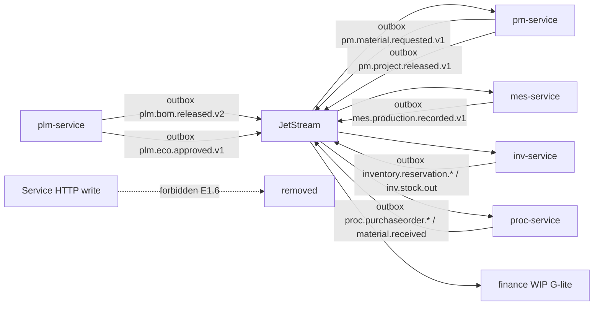
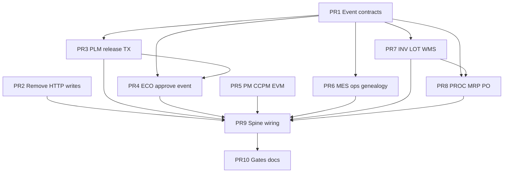

# Enterprise 0.2 — ETO Manufacturing Spine Design (Q1)

| Field | Value |
|-------|--------|
| **Document** | `docs/ENTERPRISE-0.2-ETO-DESIGN.md` |
| **Milestone** | Q1 — ETO Manufacturing Spine |
| **Tag** | `enterprise-0.2-eto-spine` |
| **Branch** | `enterprise-0.2-eto-spine` |
| **Baseline** | `enterprise-0.1-platform` (Q0) on top of `pilot-v1.1.0` |
| **Author** | Principal Architect (Enterprise 2.0 automation) |
| **Date** | 2026-08-02 |
| **Status** | **Approved for IMPLEMENT** |
| **Tenancy lock** | `DEDICATED_STACK` (STATUS; not SHARED_RLS) |
| **Secrets** | Variant **B** (`APPROVED_BY_USER_A=false`) |
| **Non-negotiables** | ADR-008 + ADR-006 + `docs/ENTERPRISE-2.0-PLAN.md` |

---

## Overview

Q0 certified the **platform** (JetStream mandatory, outbox `lockedAt`, `processed_events`, auth iss/aud/azp, secrets B, DEDICATED_STACK ADR). **Q1 deepens the manufacturing ETO value path** without expanding into finance/tax full (Q2), isolation scale (Q3), UX/MDM (Q4), or ops GA (Q5).

| Gap after Pilot + Q0 | Enterprise 0.2 requirement |
|----------------------|----------------------------|
| PLM BOM release works; ECO is create/impact only — no approve → event | ECO lifecycle emits `plm.eco.approved.v1` via outbox; BOM depth + event-only write |
| PM CCPM seed + toy EVM (`usedBufferDays * 1000`) | CCPM buffer journey real; EVM from WBS + cost signals (not demo formulas) |
| MES has Operation/AsBuilt models; routing aggregate shallow | Routing ops lifecycle + as-built genealogy wired to production record |
| INV LOT/SN + WMS models exist; receive → QUARANTINE only, weak LOT/SN | LOT/SN on receive; WMS pick path linked to reservation/`bomComponentId` |
| PROC MRP netting HTTP-reads INV; receive is TX+outbox | MRP from events + local projections; PO → receive → INV event-only stock write |
| HTTP demo write: `POST plm-integration/bom-released` still mutates PM | Remove sync HTTP **write** between services; NATS/outbox only |
| Event docs/types partial for Active spine events | Schema contracts in shared-kernel + Event Registry aligned |

**Goal:** Ship tag `enterprise-0.2-eto-spine` with live `smoke:pilot` + Playwright `e2e/pilot-eto-complete.spec.ts` green. No readiness theater. No Faza 29+. No domain scope creep beyond the manufacturing spine.

---

## Background & motivation

### What is already proven (do not re-build)

- **Traceability key:** ADR-006 `bomComponentId` end-to-end on release/reserve/production paths.
- **Active events:** `plm.bom.released.v2`, `pm.material.requested.v1`, `inventory.reservation.created.v1` / `released.v1`, `mes.production.recorded.v1`, `inv.stock.out.v1`, `proc.purchaseorder.*`, `proc.material.received.v1`, finance WIP record/reverse (G-lite).
- **Platform (Q0):** JetStream enterprise profile, outbox multi-replica claim, consumer ledger, hard auth, Variant B, ADR-009.
- **Models present:** PLM Item/BomVersion/BomComponent/ECO; PM Project/WBS/TaskDependency/ScheduleBaseline; MES WorkOrder/Operation/MaterialRequirement/AsBuilt*; INV Lot/Reservation/StockTransaction/ItemGenealogy/Warehouse/PickList; PROC Supplier/PurchaseOrder.
- **E2E gate surface:** `e2e/pilot-eto-complete.spec.ts` (12 scenarios — auth + API UAT).

### Residual that blocks enterprise manufacturing spine

| Area | Evidence in code | Impact |
|------|------------------|--------|
| PLM release TX | `release-bom-version.handler.ts`: status update then separate `outboxEvent.create` (not single `$transaction`) | Dual-write risk under crash |
| ECO approve | Create + impact only; no APPROVED→IMPLEMENTED + outbox `plm.eco.approved.v1` | Change control not enterprise-grade |
| HTTP write path | `pm-service` `POST plm-integration/bom-released` mutates WBS/materials | Bypasses outbox identity/headers; dual path |
| EVM | `GET :id/evm` uses placeholder AC formula | Not a real EVM journey |
| CCPM | Seed endpoints + fever from NCR/EAM; buffer updates partial | Journey incomplete for pilot UAT story |
| MES genealogy | AsBuilt models; production complete path partial LOT/SN → genealogy | Spine incomplete for LOT/SN WMS claim |
| INV receive | `proc.material.received.v1` bumps StockLevel QUARANTINE; often no Lot row / SN | Traceability break at goods receipt |
| PROC MRP | `mrp-netting.service.ts` sync HTTP GET INV `/inventory` | Coupled read; fragile offline; not event-projected |
| PROC ledger | No `ProcessedEvent` on proc schema | Idempotency gap on stock-out → PO create |
| Contracts | Event md files lag shared-kernel types (e.g. `bomComponentId` in v2 doc) | Contract drift |

---

## Goals & non-goals

### Goals (Q1 workstreams)

| ID | Goal |
|----|------|
| **E1.1** | PLM BOM/ECO depth: multi-level release snapshot complete; ECO approve emits event-only; release TX+outbox atomic |
| **E1.2** | PM CCPM + EVM real journey: buffer consumption from schedule slip / MES progress; EVM PV/EV/AC from project costs + % complete (no demo multipliers) |
| **E1.3** | MES routing operations + genealogy: op start/complete; production record → as-built components with LOT/SN/`bomComponentId` |
| **E1.4** | INV LOT/SN + WMS: goods receipt creates Lot (+ optional SN); pick/issue tied to reservation; genealogy chain consistent |
| **E1.5** | PROC MRP PO receive: netting without inv write-coupling; durable PO create/approve/receive; stock via events only |
| **E1.6** | Remove sync HTTP **write** paths between services (gateway→service OK; service→service mutation forbidden) |
| **E1.7** | Event schema contracts for all **Active** manufacturing spine events (types + docs + registry) |

### Non-goals

- Full Temporal saga orchestration (Q2) — keep G-lite
- Finance journal AR/AP period close, KSeF prod, Quality CAPA full, EAM IoT real adapter (Q2)
- Tenancy SHARED_RLS, NetworkPolicy, NATS 3-node HA, k6 budgets (Q3)
- MDM SoR, DMS full, global search, UI week-without-CLI (Q4)
- SLO/DR pen-test ISO GA (Q5)
- Mass-production MES, CPQ 150% BOM configurator UI, CAD import
- Readiness theater / Faza 29+ / contract self-assert counts as gates
- Secrets history rewrite; force-push master

---

## Current state vs target

| Dimension | Pilot + Q0 | Enterprise 0.2 (Q1) |
|-----------|------------|---------------------|
| BOM release | Outbox v2 + double-bom explode | TX atomic; snapshot contract frozen; projectId/tenantId required on ETO path |
| ECO | Create + impact JSON | Approve → `plm.eco.approved.v1` outbox; consumers freeze/supersede safely |
| PM write from PLM | NATS + **HTTP demo POST** | NATS only; HTTP write removed or 410 Gone |
| CCPM/EVM | Seed fever + toy EVM | Buffer math from schedule; EVM from baseline cost + progress + actual signals |
| MES ops | Models + partial routing aggregate | Op lifecycle API; genealogy on production record |
| INV receive | QUARANTINE qty only | Lot/SN + StockTransaction + optional putaway |
| WMS | PickList models | Pick against reservation/`bomComponentId`; issue updates lot |
| PROC MRP | HTTP GET INV onhand | Local stock projection from events **or** read-only query API documented as non-write; prefer projection |
| Cross-service mutation | One known HTTP write + MRP read | **Zero** service→service HTTP writes |
| Event contracts | Registry partial | Active spine events: shared-kernel TS + md + REGISTRY |
| Gates | smoke:pilot (Q0) | smoke:pilot + Playwright ETO complete |

### Target architecture (ETO spine)



---

## Workstream design

### E1.1 — PLM BOM/ECO depth (event-only write path)

**Problem:** Release is non-atomic with outbox; ECO never becomes an enterprise event; consumers rely on incomplete optional `projectId`/`tenantId`.

**Decision KD-E1.1:**

1. **Release command** wraps domain status change + `OutboxEvent` in **one** `$transaction`.
2. **Payload contract** for `plm.bom.released.v2` (frozen for Q1):
   - Required: `bomVersionId`, `itemId`, `revision`, `components[]` with **`bomComponentId`**, `childItemId`, `quantity`
   - ETO path required: `tenantId`, `projectId` (assert when `ENTERPRISE=1` / pilot ETO flows)
   - Optional: effectivity, double-bom fields (`bomLevel`, `parentBomComponentId`, `subBomVersionId`, `isSubAssembly`), `releasedBy`, `releasedAt`
3. **ECO approve** command: `PENDING|UNDER_REVIEW` → `APPROVED` (+ optional `IMPLEMENTED` when superseding BOM):
   - Emit `plm.eco.approved.v1` via outbox same TX
   - Payload: `ecoId`, `ecoNumber`, `affectedBomVersionIds[]`, `impactSummary`, `approvedBy`, `approvedAt`, `tenantId`, optional `supersedingBomVersionId`
4. **No HTTP** from PLM to PM/MES/INV/PROC for mutations.

**Alternatives rejected:**

| Alt | Why reject |
|-----|------------|
| Keep Nest EventBus local-only as primary | No durability; violates ADR-002 |
| ECO as same subject as bom.released | Different semantics; consumers need explicit change control |
| Sync PLM→PM HTTP explosion | Violates E1.6 |

**Acceptance:**

- Kill process mid-release → either both BOM RELEASED + outbox PENDING or neither.
- ECO approve → consumer can observe event (unit + live optional); registry Active.
- `docs/EVENTS/plm.bom.released.v2.md` includes `bomComponentId`.

---

### E1.2 — PM CCPM + EVM real journey

**Problem:** CCPM fever is partly real (NCR/EAM/apply-ncr-delay) but EVM is demo math; project release journey not consistently event-driven for MES WO creation.

**Decision KD-E1.2:**

1. **CCPM journey (minimal real):**
   - Project holds `totalChainDays`, `totalBufferDays`, `usedBufferDays`, `feverZone`, `ccpmBufferPct`.
   - Buffer consumption updates from: (a) schedule slip vs baseline (`ScheduleBaseline` + `schedule.service`), (b) MES production late signal (optional consumer of production progress — keep light), (c) existing NCR/EAM handlers.
   - Fever zones: GREEN &lt; 33% buffer used; YELLOW 33–66%; RED ≥ 66% (existing `apply-ncr-delay` ratios — keep consistent).
2. **EVM journey (real enough for enterprise spine):**
   - **PV** = `baselineCost` (or budget if baseline unset) — planned cost of work scheduled.
   - **EV** = PV × physical % complete from WBS (`DONE|COMPLETED` count / total) — same structure, honest source.
   - **AC** = sum of known actuals available without Q2 finance full: `actualLaborCost` + material commitment signals already on project (if none, AC = `actualLaborCost` only; **never** invent `usedBufferDays * 1000`).
   - CPI = EV/AC; SPI = EV/PV with safe zero guards.
3. **`pm.project.released.v1`:** ensure release command writes outbox TX; status RELEASED; MES continues to create WO on event (already).
4. Keep seed endpoints **dev-only** or behind non-enterprise profile; not DoD for gates.

**Alternatives rejected:**

| Alt | Why reject |
|-----|------------|
| Full MS Project parity resource leveling | Scope creep; baseline + dependencies already partial |
| Pull all AC from finance journals | Q2; use project-local actuals for Q1 |
| Drop CCPM | Product differentiator for ETO machine builders |

**Acceptance:**

- `GET /projects/:id/evm` returns non-toy AC derivation; unit tests lock formula.
- Buffer fever updates when NCR delay applied (existing) + schedule slip helper tested.
- Project release still drives MES WO via event only.

---

### E1.3 — MES routing operations + genealogy

**Problem:** Operation/AsBuilt models exist; production recorded event exists; genealogy and op lifecycle not consistently enforced on the ETO journey.

**Decision KD-E1.3:**

1. **Routing/ops:**
   - On WO create from BOM: seed Operations from simple default routing if none (sequence 10, 20, …) **or** accept explicit routing payload — no new external service.
   - API: start operation, complete operation (status transitions PENDING→IN_PROGRESS→COMPLETED); operator session optional.
2. **Production record path:**
   - Recording production / completing WO: write `ProductionRecord` + ensure `AsBuiltRecord`/`AsBuiltComponent` rows with `bomComponentId`, `lotId`, `serialNumber` when provided.
   - Outbox `mes.production.recorded.v1` **same TX** (if not already).
3. **Genealogy handoff:** payload includes enough for INV to write `ItemGenealogy` (workOrderId, bomComponentIds, lots/serials). Prefer extending existing consumer rather than dual write.
4. **Idempotency:** production handlers use `withProcessedEventGuard` (Q0).

**Alternatives rejected:**

| Alt | Why reject |
|-----|------------|
| Full APS/scheduling engine | Out of Q1 |
| IoT machine data collection | Q2 EAM/IoT |
| Separate genealogy service | Violates ADR-003 boundaries; INV+MES own as-built |

**Acceptance:**

- Op complete → visible status; production → as-built components queryable.
- Live/smoke path non-worse; e2e auth scenarios still pass.

---

### E1.4 — INV LOT/SN + WMS traceability

**Problem:** Goods receipt updates location qty without always creating `Lot`; WMS pick not forced onto reservation spine; genealogy chain gaps.

**Decision KD-E1.4:**

1. **On `proc.material.received.v1` (INV consumer):**
   - Resolve Item by SKU; create/update StockLevel.
   - Create **`Lot`** with `lotNumber` (from payload or generated `LOT-{poId short}-{ts}`); optional `serialNumber` when qty=1 and SN provided.
   - Immutable `StockTransaction` type RECEIPT with lotId, reference PO, `bomComponentId` in notes or dedicated field if migrated.
   - Prefer TX + ProcessedEvent guard.
2. **Reservation / issue:**
   - Keep `bomComponentId` on Reservation (ADR-006).
   - WMS: pick lines can reference reservation or projectId; completing pick issues stock from lot (status PICKED/ISSUED).
3. **Genealogy:** on production complete / reservation release, write `ItemGenealogy` parentSerialOrLot ← machine SN or WO; child lot/bomComponentId.
4. **Events:** optional `inventory.lot.created.v1` if useful for analytics — **Active only if emitted**; else stay Planned. Do not force registry theater.

**Alternatives rejected:**

| Alt | Why reject |
|-----|------------|
| Serial mandatory on every receipt | Multi-qty lots common; SN optional |
| External WMS product | In-module Warehouse/Bin/PickList already present |

**Acceptance:**

- Receive → Lot row exists; stock transaction audit present.
- Genealogy chain API still returns forward/backward for seeded serials.

---

### E1.5 — PROC MRP / PO / receive

**Problem:** MRP netting uses sync HTTP GET to INV; shortage path event-driven; receive already TX+outbox.

**Decision KD-E1.5:**

1. **MRP onhand source (KD-E1.5a):** Replace hard dependency on live INV HTTP for **write decisions** with:
   - **Preferred:** local `StockProjection` table (sku → qty) updated by consumers of reservation/release/receive/stock-out events; MRP reads local only.
   - **Acceptable fallback for Q1 if time-boxed:** keep HTTP **read** only for netting report (explicitly not a write path), document as residual; **must not** POST/PATCH to INV from PROC.
2. **MRP run:** draft POs with `source=MRP`, `bomComponentId`/`projectId` when known; create via command + outbox `proc.purchaseorder.created.v1` in TX.
3. **Approve / receive:** existing handlers hardened; ensure ProcessedEvent on INV stock-out consumer in PROC (schema add).
4. **Long-lead radar:** PLM HTTP product list is **read** — allowed; no writes.

**Alternatives rejected:**

| Alt | Why reject |
|-----|------------|
| PROC owns inventory truth | Violates ADR-003 |
| Shared DB join INV | Forbidden |
| Full MRP II infinite horizon | Scope; netting + draft PO is enough for ETO spine |

**Acceptance:**

- PO create/approve/receive still emit Active events.
- No PROC→INV HTTP POST/PATCH.
- `ProcessedEvent` on proc for inv.stock.out consumer.

---

### E1.6 — Remove sync HTTP write-path between services

**Problem:** `POST .../plm-integration/bom-released` on PM still mutates domain (WBS + material requests). Any similar demo hooks must die.

**Decision KD-E1.6:**

1. **Inventory of service→service HTTP writes** (mutations): remove or return **410** with message “use NATS event”.
2. **Known item:** `apps/pm-service/src/plm-integration.controller.ts` `@Post('plm-integration/bom-released')` — remove handler or hard-disable under `ENTERPRISE=1`/`PILOT=1` (prefer remove + update tests to EventPattern only).
3. **Allowed:**
   - Browser/Gateway → service HTTP (normal API)
   - Service → service **GET** for projections residual (E1.5) until projection lands — document as residual risk
4. **CI guard (light):** grep-based check in gate or unit forbidding `fetch(.*SERVICE_URL` with method POST/PATCH/PUT in apps/*-service (optional script; not theater).

**Alternatives rejected:**

| Alt | Why reject |
|-----|------------|
| Keep HTTP for “simplicity” | Dual path; identity headers lost; ADR-002 |
| mTLS internal REST mesh | Out of Q1 |

**Acceptance:**

- No integration `@Post` that applies ETO spine mutations from other BC.
- BOM explosion tests use EventPattern/handler private method only.

---

### E1.7 — Event schema contracts for Active events

**Problem:** Registry and md files drift from shared-kernel types; consumers use `any`.

**Decision KD-E1.7:**

For each **Active** manufacturing-spine event, enforce trio:

1. `apps/shared-kernel/src/events/*.ts` — exported interface
2. `docs/EVENTS/{name}.md` — payload SSOT narrative
3. `docs/EVENTS/REGISTRY.md` — Active line accurate

**Active set (Q1 contract freeze):**

| Event | Producer | Primary consumers |
|-------|----------|-------------------|
| `plm.bom.released.v2` | plm | pm, mes, inv, proc |
| `plm.eco.approved.v1` | plm | pm, mes (optional freeze) — **promote Active** |
| `pm.material.requested.v1` | pm | inv |
| `pm.project.released.v1` | pm | mes — ensure Active if emitted |
| `inventory.reservation.created.v1` | inv | mes/finance optional |
| `inventory.reservation.released.v1` | inv | finance |
| `mes.production.recorded.v1` | mes | inv, finance |
| `inv.stock.out.v1` | inv | proc |
| `proc.purchaseorder.created.v1` | proc | — |
| `proc.purchaseorder.approved.v1` | proc | pm, finance |
| `proc.material.received.v1` | proc | inv, quality |

**Rules:**

- Breaking field remove → new version (`.v2`/`.v3`), never silent break.
- Additive optional fields OK on same version with docs update.
- `bomComponentId` required on operational material path events where ADR-006 applies.

**Alternatives rejected:**

| Alt | Why reject |
|-----|------------|
| Pact broker full | TD residual; Q1 uses types + md + live smoke |
| JSON Schema registry service | Overkill; TS interfaces + docs enough |

**Acceptance:**

- Typecheck consumers against shared-kernel interfaces (no payload `any` on spine handlers — stretch: at least new/edited handlers).
- REGISTRY matches code emit sites for Q1 set.

---

## Key decisions summary

| ID | Decision |
|----|----------|
| KD-E1.1 | PLM release+ECO approve atomic outbox; freeze bom.released.v2 + eco.approved.v1 contracts |
| KD-E1.2 | Real EVM (PV/EV/AC no toy formula); CCPM fever consistent ratios; project release event path |
| KD-E1.3 | MES op lifecycle + as-built genealogy on production TX |
| KD-E1.4 | INV receive creates Lot/SN; WMS pick/issue on reservation spine |
| KD-E1.5 | PROC MRP prefers local projection; zero HTTP writes to INV; ProcessedEvent on proc |
| KD-E1.6 | Remove service→service HTTP write paths (PM bom-released POST) |
| KD-E1.7 | Active spine events: types + md + REGISTRY freeze |
| KD-E1.8 | Tenancy remains DEDICATED_STACK; secrets Variant B; JetStream mandatory enterprise |
| KD-E1.9 | Gates = live smoke + Playwright ETO — never readiness file counts |
| KD-E1.10 | Scope lock: manufacturing spine only; finance depth deferred Q2 |

---

## Alternatives (program-level)

| Topic | Chosen | Rejected |
|-------|--------|----------|
| Integration style | Event + outbox only for writes | Sync HTTP write mesh |
| MRP onhand | Event projection (preferred) | Shared DB; RPC writes |
| EVM source | Project baseline + WBS % + local actuals | Full GL journal AC (Q2) |
| ECO | Dedicated approved event | Overloaded bom.released |
| Genealogy ownership | MES as-built + INV ItemGenealogy | New BC |
| Orchestration | G-lite continue | Temporal workers (Q2) |

---

## Security

| Control | Q1 action |
|---------|-----------|
| Authn | Unchanged Q0 hard iss/aud/azp; AUTH always on enterprise |
| Authz | Existing `ETO_MUTATION_ROLES` on PLM release, ECO approve, PM release, MES production, INV issue, PROC approve/receive |
| Secrets | No new secrets; Variant B; ci-no-secrets |
| Tenancy | JWT tenant only; DEDICATED_STACK |
| Event identity | Propagate `x-user-id` / `x-roles` on release/production (ADR-006 TD-001) |
| Abuse | Gateway rate-limit (Q0) unchanged |
| Audit | Outbox + StockTransaction immutable log; ECO approve actor |

Threat notes:

- **HTTP write bypass** → identity/outbox skip → E1.6 removes.
- **Double PO / double stock** → ProcessedEvent on proc + inv (Q0/Q1).
- **Wrong BOM line consume** → bomComponentId required on operational payloads.

---

## Risks & residuals

| ID | Risk | Sev | Mitigation / residual |
|----|------|-----|------------------------|
| R-Q1-1 | Stock projection lag vs live INV HTTP | Med | Accept eventual consistency; document; optional refresh job |
| R-Q1-2 | EVM AC incomplete without full finance | Med | Honest AC from available actuals; Q2 deepens |
| R-Q1-3 | ECO consumer side-effects incomplete | Med | Approve event + docs; full supersede automation residual |
| R-Q1-4 | Playwright e2e needs Keycloak + stack | Med | Same as pilot; gate already lists it |
| R-Q1-5 | Multi-service migration churn | Med | Small ordered PRs; migrate-only under PILOT |
| R-Q1-6 | Dual Nest+JS consumers residual on non-migrated subjects | Med | Prefer JS path when flag on (Q0 rule); no new dual subscribe |
| R-Q1-7 | Domain scope creep pressure | High | Non-goals + KD-E1.10; reject Q2/Q4 features |
| R-Q1-8 | PROC still HTTP-reads PLM for long-lead | Low | Read-only allowed residual |

---

## Testing & gates (Q1)

From `docs/enterprise-2.0/milestones.json`:

```bash
pnpm run smoke:pilot
REQUIRE_LIVE=1 REQUIRE_LIVE_STRICT=1 pnpm run smoke:pilot
./node_modules/.bin/playwright test e2e/pilot-eto-complete.spec.ts
bash scripts/enterprise-2.0/gate-check.sh Q1
```

IMPLEMENT-era additions (wire into unit/smoke where cheap):

- PLM release TX: outbox present iff status RELEASED (unit).
- ECO approve emits outbox row (unit).
- PM EVM: AC not using buffer×1000 (unit).
- INV receive creates Lot (unit/integration).
- PM: HTTP bom-released absent or 410 (unit).
- Event types compile for spine handlers.

**Forbidden gate substitutes:** readiness JSON, contract self-assert counts, Faza 29+ theater.

---

## Rollout

1. DESIGN (this doc) → STATUS `IMPLEMENT`.
2. IMPLEMENT on `enterprise-0.2-eto-spine` (from master / Q0 tag) following PR Plan order.
3. GATE via `gate-check.sh Q1` (live stack + Playwright).
4. RELEASE: PR → master, tag `enterprise-0.2-eto-spine`, advance automation to Q2 DESIGN.

Compose/boot: inherit Q0 enterprise env (`ENTERPRISE=1`, `NATS_JETSTREAM=true`, JWT claims).

---

## PR Plan

Ordered, mergeable slices. Each PR must keep `smoke:pilot` non-worse; domain work only within ETO spine.

### PR 1: Contracts — Active spine event types + Event Registry + md sync

- **Dependencies:** none
- **Files:**
  - `apps/shared-kernel/src/events/plm.events.ts` (+ eco types)
  - `apps/shared-kernel/src/events/pm.events.ts`, `mes.events.ts`, `inv.events.ts`, `proc.events.ts` as needed
  - `apps/shared-kernel/src/events/index.ts`
  - `docs/EVENTS/*.md` for Active spine set
  - `docs/EVENTS/REGISTRY.md`
- **Description:** Freeze TS interfaces and docs for Active manufacturing events; add `PlmEcoApprovedV1Event`; fix `plm.bom.released.v2.md` to include `bomComponentId` and ETO fields. No behavior change required beyond types export.

### PR 2: Integration — remove service→service HTTP write paths

- **Dependencies:** none (can parallel PR 1)
- **Files:**
  - `apps/pm-service/src/plm-integration.controller.ts` (remove `@Post('plm-integration/bom-released')`)
  - `apps/pm-service/src/plm-integration.controller.spec.ts`
  - any other integration `@Post` write shims found in mes/inv/proc spine
  - optional `scripts/check-no-interservice-http-write.sh` + package.json script
- **Description:** EventPattern-only mutations for PLM→PM; tests call private/process method or emit pattern. Document allowed GET residual for MRP until PR 7.

### PR 3: PLM — atomic BOM release TX + payload assert

- **Dependencies:** PR 1 recommended
- **Files:**
  - `apps/plm-service/src/commands/release-bom-version.handler.ts`
  - `apps/plm-service/src/commands/*` tests
  - double-bom snapshot path if needed for contract fields
- **Description:** Single `$transaction` for status RELEASED + outbox `plm.bom.released.v2`; ensure components include `bomComponentId`; accept `projectId`/`tenantId` on command when provided.

### PR 4: PLM — ECO approve command + `plm.eco.approved.v1` outbox

- **Dependencies:** PR 1, PR 3 recommended
- **Files:**
  - `apps/plm-service/src/commands/approve-eco.handler.ts` (new)
  - `apps/plm-service/src/plm.controller.ts` (approve route + RBAC)
  - prisma only if extra ECO fields needed (optional approvedBy)
  - unit tests
- **Description:** Transition ECO to APPROVED; outbox event same TX; impactSummary included. Optional light consumer in PM (fever or log) — not mandatory full supersede.

### PR 5: PM — CCPM buffer journey + honest EVM

- **Dependencies:** none (can parallel PLM after PR 2)
- **Files:**
  - `apps/pm-service/src/project.controller.ts` (`getEvm`)
  - `apps/pm-service/src/schedule.service.ts` and/or new `evm.service.ts` / `ccpm.service.ts`
  - `apps/pm-service/src/commands/*` if release needs TX outbox harden
  - unit tests for EVM/CCPM formulas
- **Description:** Replace toy AC; compute fever from buffer usage consistently; ensure project release emits `pm.project.released.v1` via outbox TX if gaps remain.

### PR 6: MES — routing operations lifecycle + as-built genealogy on production

- **Dependencies:** PR 1
- **Files:**
  - `apps/mes-service/src/commands/*` (production record, complete op)
  - `apps/mes-service/src/routing.controller.ts` / `routing-aggregate.service.ts`
  - `apps/mes-service/src/pm-integration.controller.ts` (only if event payload typing)
  - tests
- **Description:** Op start/complete; production TX writes AsBuilt* + outbox `mes.production.recorded.v1` with bomComponentIds/lots when known.

### PR 7: INV — LOT/SN on receive + WMS pick/issue spine + genealogy

- **Dependencies:** PR 1
- **Files:**
  - `apps/inv-service/src/proc-integration.controller.ts` (or command handler extract)
  - `apps/inv-service/src/wms.controller.ts` / commands
  - `apps/inv-service/src/genealogy.controller.ts` if chain needs lot linkage
  - `apps/inv-service/src/pm-integration.controller.ts` production consumer (genealogy)
  - unit tests
- **Description:** Material received → Lot + StockTransaction; pick/issue respects reservation/`bomComponentId`; genealogy writes on production/release.

### PR 8: PROC — MRP projection or documented read residual + ProcessedEvent + PO path harden

- **Dependencies:** PR 1; PR 7 for end-to-end receive if testing full chain
- **Files:**
  - `apps/proc-service/prisma/schema.prisma` + migration `ProcessedEvent`
  - `apps/proc-service/src/mrp-netting.service.ts`
  - `apps/proc-service/src/inv-integration.controller.ts` (idempotent guard)
  - `apps/proc-service/src/commands/create-purchase-order.handler.ts`, `receive-material.handler.ts`
  - `apps/proc-service/src/plm-mrp.controller.ts`, `mrp.controller.ts`
  - tests
- **Description:** Prefer stock projection consumer; if deferred, confine INV access to GET only and comment residual R-Q1-1. Wire ProcessedEvent on stock-out→PO. No HTTP writes to INV.

### PR 9: Spine wiring — consumers use contracts; JetStream path respect; e2e smoke polish

- **Dependencies:** PR 2–8
- **Files:**
  - consumer controllers across pm/mes/inv/proc for typed payloads
  - `e2e/pilot-eto-complete.spec.ts` only if scenario gaps for spine APIs (no theater expansion)
  - optional `scripts/eto-chain-smoke.ts` alignment
  - `docs/TECHNICAL-DEBT.md` honesty (HTTP write closed; domain residuals)
- **Description:** End-to-end consistency; preferJetStreamConsumerPath respected; fix regressions from PR 2–8.

### PR 10: Quality — Q1 gate green + docs honesty

- **Dependencies:** PR 1–9 functionally
- **Files:**
  - `docs/PROJECT-STATE.md` / `docs/TECHNICAL-DEBT.md` minimal honesty
  - `docs/FAZA1-MANUFACTURING-CLOSURE.md` note enterprise supersedes pilot closure claims where relevant
  - package.json only if gate script glue needed
- **Description:** Ensure `gate-check.sh Q1` commands pass; no readiness theater; STATUS advanced by RELEASE automation.

### PR dependency graph



**Suggested parallel tracks:**

- Track A: PR1 → PR3 → PR4
- Track B: PR2
- Track C: PR5
- Track D: PR1 → PR6
- Track E: PR1 → PR7 → PR8
- Integrate: PR9 → PR10

---

## Self-review (design quality)

| Check | Result |
|-------|--------|
| Maps 1:1 to Q1 workstreams | Yes (E1.1–E1.7) |
| ADR-008 non-negotiables honored | Yes |
| ADR-006 bomComponentId spine | Yes |
| PR Plan has `### PR N:` sections | Yes (1–10) |
| No Q2/Q3/Q4/Q5 scope creep | Yes (non-goals + KD-E1.10) |
| No readiness theater / Faza 29+ | Yes |
| Secrets A not auto-executed | Yes |
| Tenancy DEDICATED_STACK locked | Yes |
| Honest residuals (EVM AC, MRP projection) | Yes |
| HTTP write removal explicit | Yes E1.6 / PR2 |

---

## Definition of done (milestone Q1)

- [ ] All PRs 1–10 merged to milestone branch / master via RELEASE process
- [ ] `bash scripts/enterprise-2.0/gate-check.sh Q1` exit 0
- [ ] Playwright `e2e/pilot-eto-complete.spec.ts` green under live auth stack
- [ ] Tag `enterprise-0.2-eto-spine` pushed
- [ ] STATUS advances to Q2 DESIGN
- [ ] No secrets committed; no force-push master; no inter-service HTTP writes on spine

---

## References

- `docs/ADRs/ADR-008-Enterprise-2.0-Non-Negotiables.md`
- `docs/ADRs/ADR-006-BomComponentId-Traceability-Spine.md`
- `docs/ADRs/ADR-002-Event-Communication-NATS-Outbox.md`
- `docs/ADRs/ADR-003-Database-per-Service-Strategy.md`
- `docs/ADRs/ADR-009-Tenancy-Dedicated-Stack.md`
- `docs/ENTERPRISE-2.0-PLAN.md`
- `docs/ENTERPRISE-2.0-STATUS.md`
- `docs/enterprise-2.0/milestones.json`
- `docs/ENTERPRISE-0.1-PLATFORM-DESIGN.md` (Q0)
- `docs/EVENTS/REGISTRY.md`
- `docs/MODULES/01-plm/BLUEPRINT.md` … `04-inv/BLUEPRINT.md`
- `docs/FAZA1-MANUFACTURING-CLOSURE.md`
- `docs/PILOT-V1-DESIGN.md`
- `e2e/pilot-eto-complete.spec.ts`
- `apps/shared-kernel/src/events/*`
- `apps/shared-kernel/src/types/eto-saga.ts`
