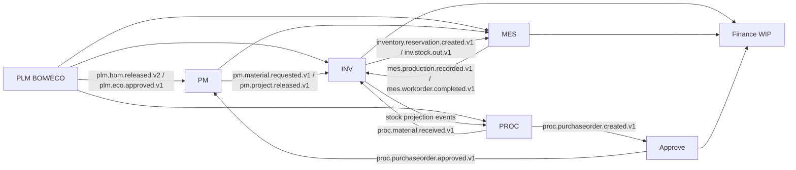
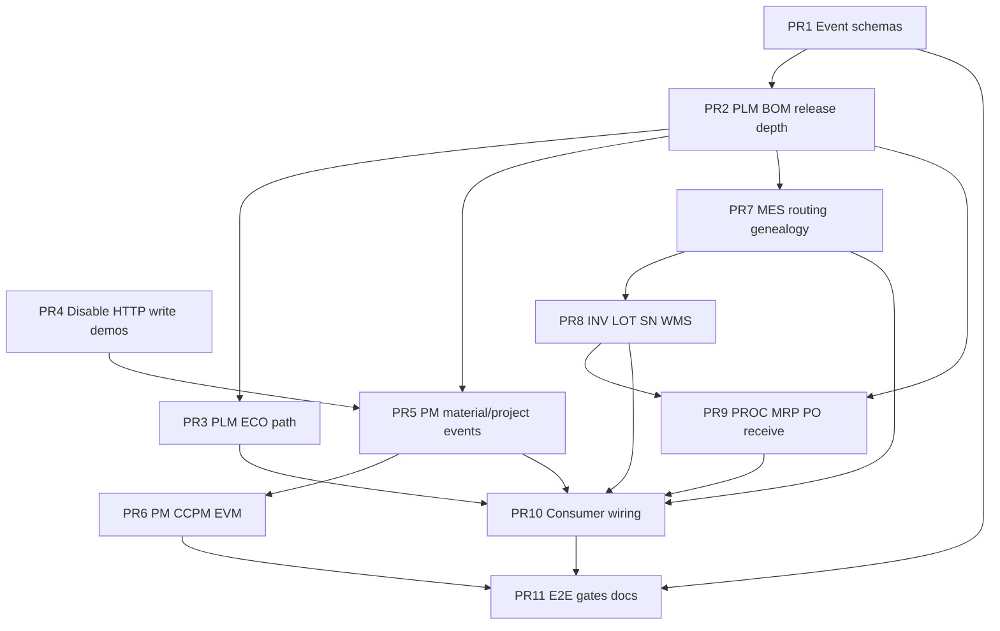

# Enterprise 0.2 — ETO Manufacturing Spine Design (Q1)

| Field | Value |
|-------|--------|
| **Document** | `docs/ENTERPRISE-0.2-ETO-DESIGN.md` |
| **Milestone** | Q1 — ETO Manufacturing Spine |
| **Tag** | `enterprise-0.2-eto-spine` |
| **Branch** | `enterprise-0.2-eto-spine` |
| **Baseline** | `enterprise-0.1-platform` (Q0) / pilot-v1.1.0 |
| **Author** | Principal Architect (Enterprise 2.0 automation) |
| **Date** | 2026-08-02 |
| **Status** | **Approved for IMPLEMENT** |
| **Tenancy lock** | `DEDICATED_STACK` (STATUS; not SHARED_RLS) |
| **Secrets** | Variant **B** (`APPROVED_BY_USER_A=false`) |
| **Non-negotiables** | ADR-008 + `docs/ENTERPRISE-2.0-PLAN.md` |
| **Depends on** | Q0 platform certification (JetStream mandatory, outbox lockedAt, processed_events, auth hard) |

---

## Overview

Q0 certified the **platform** (messaging, outbox multi-replica, consumer idempotency, auth, tenancy ADR). **Q1 deepens the ETO manufacturing spine** without expanding finance/tax/Temporal (those are Q2), isolation/HA (Q3), or full UX/MDM (Q4).

Pilot Faza 1 proved a **demo-grade** ETO chain: `plm.bom.released.v2` → PM material request → INV reservation → MES production → Finance WIP, with `bomComponentId` as correlation key (ADR-006). Residual gaps block enterprise manufacturing claims:

| Gap after Pilot + Q0 | Enterprise Q1 requirement |
|----------------------|---------------------------|
| BOM release snapshot often missing `bomComponentId` in event docs / partial consumers | Full depth BOM + ECO path; event contracts with `bomComponentId` on every line |
| ECO approved largely Planned / demo HTTP | ECO → supersede BOM → re-release event-only |
| PM CCPM/EVM seeded mocks; critical chain partial | Real journey: WBS → critical chain → buffer → EVM from actuals |
| MES routing/ops/genealogy incomplete for as-built | Routing ops complete; genealogy linked to LOT/SN + bomComponentId |
| INV LOT/SN + WMS pick path thin | Lot/SN on reserve/issue/receive; WMS pick → stock-out events |
| PROC MRP netting uses **sync HTTP reads** to INV/PLM | Event/projection-driven MRP + PO → receive → INV stock (no inter-service write HTTP) |
| Legacy `*-integration` POST endpoints as write path | Remove sync HTTP **write** path between services; HTTP allowed for **gateway→service** and **read projections** only where documented |
| Event registry incomplete / schema drift | Active event schema contracts (JSON Schema or zod) for spine events |

**Goal:** Ship tag `enterprise-0.2-eto-spine` with live smoke + Playwright ETO e2e green. Domain depth is real (not theater). No Faza 29+. No finance full / KSeF / Temporal (Q2).

---

## Background & motivation

### What Pilot + Q0 already proved (do not re-build)

- Platform: JetStream enterprise profile, outbox `lockedAt`, `processed_events`, auth iss/aud/azp, DEDICATED_STACK ADR-009.
- ADR-006: `bomComponentId` as manufacturing correlation key.
- Active spine events (partial): `plm.bom.released.v2`, `pm.material.requested.v1`, `inventory.reservation.created.v1` / `.released.v1`, `mes.production.recorded.v1`, `inv.stock.out.v1`, `proc.purchaseorder.created.v1` / `.approved.v1`, `proc.material.received.v1`.
- Models exist: PLM BomVersion/BomComponent/ECO; PM Project/WBS/Task; MES WorkOrder/Operation/AsBuilt*; INV Lot/Reservation/Genealogy/WMS; PROC PO/MRP services.
- G-lite saga compensation + reverse WIP (pilot); multi-replica outbox safe after Q0.

### Residual that blocks enterprise manufacturing tag

1. **PLM depth:** ECO lifecycle incomplete; BOM multi-level explode not always in release payload; event doc v2 still omits `bomComponentId` while code/ADR require it.
2. **PM journey:** CCPM seed/demo endpoints; EVM may use incomplete actuals; material request not always event-only from BOM consume.
3. **MES:** Routing ops incomplete; genealogy not always written on production complete with LOT/SN.
4. **INV:** LOT/SN optional on many paths; WMS pick not fully event-wired to stock-out.
5. **PROC:** `mrp-netting.service.ts` and `long-lead-radar.service.ts` use **sync HTTP GET** to INV/PLM — read coupling; any remaining POST write to peer services must go.
6. **Contracts:** Registry marks several events Planned; Active payloads lack machine-checkable schemas.

---

## Goals & non-goals

### Goals (Q1 workstreams)

| ID | Goal |
|----|------|
| **E1.1** | PLM BOM/ECO depth with **event-only** write path to downstream (release + ECO approved) |
| **E1.2** | PM CCPM + EVM **real journey** (critical chain, buffers, EV from MES/cost events) |
| **E1.3** | MES routing operations + genealogy (as-built + bomComponentId + LOT/SN refs) |
| **E1.4** | INV LOT/SN + WMS traceability (reserve/issue/receive/pick → events + ItemGenealogy) |
| **E1.5** | PROC MRP → PO → approve → receive fully event-driven to INV |
| **E1.6** | Remove sync HTTP **write** path between domain services |
| **E1.7** | Event schema contracts for **Active** manufacturing spine events |

### Non-goals (explicit)

- Full Finance journal / AR-AP period close, KSeF prod, Quality NCR/CAPA full, Temporal workers — **Q2**
- Tenancy SHARED_RLS, NetworkPolicy, NATS 3-node HA, k6 budgets — **Q3**
- MDM SoR, DMS, full UI CRUD week, global search — **Q4**
- Multi-region, AI ERP, mass-production MES — **2.1+**
- Secrets Variant A / filter-repo without `APPROVED_BY_USER_A`
- Readiness theater / Faza 29+

---

## Current state vs target

| Dimension | Pilot / after Q0 | Enterprise 0.2 (Q1) |
|-----------|------------------|---------------------|
| PLM BOM release | v2 snapshot; bomComponentId ADR partial | Full multi-level snapshot + bomComponentId required; ECO supersede → re-release |
| PM | Demo seed CCPM; partial EVM | Project release → WBS explode from BOM → critical chain + buffer; EVM PV/EV/AC from real data |
| MES | Production record + partial as-built | Routing ops start/complete; as-built components; genealogy events |
| INV | Reservation + lot optional | LOT/SN required for tracked items; WMS pick → stock-out; genealogy API honest |
| PROC | MRP with HTTP INV/PLM reads; PO events partial | Stock/BOM projections or events for MRP; receive → INV stock via event only |
| Inter-service writes | Some integration POST + demos | **Forbidden**; only NATS/JetStream + outbox |
| Event contracts | Markdown registry | Markdown + machine schema (zod/JSON Schema) + CI check for Active spine set |
| Gates | smoke:pilot | + Playwright `e2e/pilot-eto-complete.spec.ts` under live |

### Target ETO spine (event-only writes)



**Rule:** Domain service A must not `POST`/`PUT`/`PATCH` domain service B to mutate B’s state. Gateway → service remains HTTP. **Read-only** HTTP for operational projections is transitional only if listed in risks and removed or replaced by local projection by end of Q1 where on critical path (MRP).

---

## Key Decisions

### KD-E1.1 — BOM release payload must include `bomComponentId` per line (contract hard)

Align event docs + producers with ADR-006:

```json
{
  "bomVersionId": "uuid",
  "itemId": "uuid",
  "revision": "string",
  "components": [
    {
      "bomComponentId": "uuid",
      "childItemId": "uuid",
      "childPartNumber": "string",
      "quantity": "decimal-string",
      "position": 10,
      "level": 0,
      "parentBomComponentId": null,
      "makeBuy": "BUY"
    }
  ],
  "releasedAt": "ISO-8601",
  "releasedBy": "string",
  "correlationId": "uuid"
}
```

- Multi-level: flatten with `level` + optional `parentBomComponentId` (depth ≤ N, default 8).
- Quantities: decimal string on wire for consistency with money discipline (component qty may remain number only if non-money — prefer string for schema stability).
- Consumers reject release without `bomComponentId` under `ENTERPRISE=1` (fail closed log + DLQ, no silent ignore).

### KD-E1.2 — ECO path is event-only

1. ECO created/approved in PLM TX → outbox `plm.eco.approved.v1`.
2. Approved ECO may supersede BOM version and emit new `plm.bom.released.v2` (or `plm.bom.changed.v1` if only delta — prefer full re-release for consumer simplicity).
3. No HTTP call from PLM to PM/MES/INV/PROC for ECO application.

### KD-E1.3 — PM CCPM/EVM real journey

| Concept | Implementation |
|---------|----------------|
| Project release | `pm.project.released.v1` after WBS materialised from BOM (or CRM accept already present) |
| Critical chain | Longest path on TaskDependency + resource contention flag (single resource type OK for Q1) |
| Buffer | Project buffer as WBS element type `BUFFER`; feeding buffers optional v1 |
| Material request | Outbox `pm.material.requested.v1` with bomComponentId (already Active) — no demo POST to INV |
| EVM | PV from baseline schedule; EV from completed WBS weight × BAC; AC from Finance/MES cost events projection or local cost fields updated by **events** only |

Remove or gate `seedCCPM` / mock-only paths under enterprise profile.

### KD-E1.4 — MES routing + genealogy

- WorkOrder has ordered Operations; start/complete ops emit or accumulate into `mes.production.recorded.v1` (keep Active event; add fields: operationId, lotIds[], serialNumbers[], bomComponentIds[]).
- On complete: write AsBuiltComponent + outbox; INV genealogy consumer updates ItemGenealogy.
- `mes.workorder.completed.v1` promoted Active when full WO complete.

### KD-E1.5 — INV LOT/SN + WMS

- Items with tracking flag (or makeBuy BUY with lot control default on enterprise) **require** lotId on issue/reserve for tracked materials.
- WMS PickList confirm → StockTransaction + `inv.stock.out.v1` / reservation release as today.
- Genealogy: parent SN/LOT ← child SN/LOT + bomComponentId.

### KD-E1.6 — PROC MRP without write HTTP; minimize read HTTP

| Interaction | Q1 target |
|-------------|-----------|
| Shortage | Consume `inv.stock.out.v1` / reservation fail events → PO create outbox |
| MRP netting stock | Prefer local **StockProjection** table updated by INV events; interim: keep GET only if read-only and not on write path |
| BOM for MRP | Consume `plm.bom.released.v2` into local BOM projection |
| PO create/approve/receive | TX + outbox only |
| Receive | `proc.material.received.v1` → INV stock in (consumer) |

**Forbidden:** PROC POSTing into INV to create stock; INV POSTing into PROC to create PO (except existing event-driven reverse).

### KD-E1.7 — Event schema contracts

- Location: `docs/EVENTS/schemas/{event}.schema.json` **or** `apps/shared-kernel/src/events/schemas/*.ts` (zod) re-exported.
- CI: script validates Active spine events listed in design DoD against samples + optionally runtime assert in producers under `ENTERPRISE=1`.
- Version rule: breaking change → new version file (`.v3`); never silently change Active vN.

### KD-E1.8 — Sync HTTP write path removal

Inventory all `*-integration.controller` **mutation** endpoints used cross-service:

- Keep only for **gateway/UI/demo** with explicit `X-Demo-Only` or disable when `ENTERPRISE=1`.
- Production path: NATS JetStream durable consumers (Q0) only.
- Analytics/readiness GETs may remain (read).

---

## Alternatives

| Alternative | Decision | Why |
|-------------|----------|-----|
| Keep integration HTTP writes + events dual path | **Reject** | Dual path → split-brain; violates ADR-002 / Q1 goal E1.6 |
| Kafka / Temporal for spine orchestration in Q1 | **Reject** | Temporal is Q2; NATS+outbox sufficient for spine |
| Only itemId correlation (drop bomComponentId) | **Reject** | ADR-006 accepted; ETO ambiguity |
| Shared DB views across PLM/INV for MRP | **Reject** | ADR-003 database-per-service |
| Full multi-level recursive BOM in one event unlimited depth | **Bound** | Cap depth; document phantom/sub-assembly policy |
| Shared-kernel event bus library rewrite | **Defer** | Use existing outbox + JetStream kernel from Q0 |
| GraphQL federation for manufacturing | **Out of scope** | REST gateway pure proxy remains |

---

## Workstream design

### E1.1 — PLM BOM/ECO depth event-only write path

**Scope**

- `BomComponent` multi-level explode on release (recursive, depth cap).
- Release command: single TX write BomVersion status RELEASED + OutboxEvent `plm.bom.released.v2` with full components[].
- ECO: status machine DRAFT → IN_REVIEW → APPROVED → IMPLEMENTED; on APPROVED emit `plm.eco.approved.v1` and apply to BOM (new version + release event).
- Deprecate dual HTTP demo that mutates PM state without event.

**Files (indicative):** `apps/plm-service/src/**`, `apps/plm-service/prisma/**`, `docs/EVENTS/plm.bom.released.v2.md`, `docs/EVENTS/plm.eco.approved.v1.md`.

**Acceptance:** Release → PM/MES/INV/PROC consumers update without any PLM→peer HTTP write; contract tests green.

### E1.2 — PM CCPM EVM real journey

**Scope**

- From BOM release: materialise/refresh WBS or material requirements; emit `pm.material.requested.v1`.
- Critical chain computation in `schedule.service.ts` (harden); expose via API already present.
- EVM endpoint uses Decimal/BAC from baseline + progress from MES/task complete events.
- `pm.project.released.v1` Active when project baseline locked.

**Acceptance:** Live project journey without `seedCCPM` under enterprise; SPI/CPI computed from non-mock data in smoke/e2e.

### E1.3 — MES routing operations genealogy

**Scope**

- Ensure Operation lifecycle and production recording write AsBuilt* + outbox.
- Consume BOM release for MaterialRequirement.bomComponentId.
- Emit completed WO event; genealogy fields on production.recorded.

**Acceptance:** Production complete creates genealogy links consumable by INV; e2e scenario asserts as-built.

### E1.4 — INV LOT/SN WMS traceability

**Scope**

- Lot create/assign on receive and issue; SN where applicable (simple serial table or Lot.serialNumbers JSON — prefer explicit SerialNumber model if missing).
- WMS pick confirm path evented.
- Genealogy controller returns honest forward/backward for bomComponentId.

**Acceptance:** Reserve/issue/receive with lot; genealogy non-empty after MES complete for tracked parts.

### E1.5 — PROC MRP PO receive

**Scope**

- MRP uses BOM projection + stock projection (events); create PO outbox.
- Approve → `proc.purchaseorder.approved.v1`.
- GR → `proc.material.received.v1` → INV increases stock/lot.

**Acceptance:** Shortage → PO → receive → stock without PROC writing INV over HTTP.

### E1.6 — Remove sync HTTP write-path

**Scope**

- Grep audit: fetch/axios POST to peer service URLs in apps/*-service (exclude gateway, frontend, mcp, analytics readiness GETs).
- Replace write demos with event publishers or delete under ENTERPRISE=1.
- Document remaining **read** HTTP in TECHNICAL-DEBT if any must stay one milestone (prefer zero on critical path).

**Acceptance:** `scripts` or unit audit: zero inter-service mutation HTTP on enterprise profile.

### E1.7 — Event schema contracts for Active events

**Active spine set (minimum contracts):**

1. `plm.bom.released.v2`
2. `plm.eco.approved.v1`
3. `pm.material.requested.v1`
4. `pm.project.released.v1`
5. `inventory.reservation.created.v1`
6. `inventory.reservation.released.v1`
7. `inv.stock.out.v1`
8. `mes.production.recorded.v1`
9. `mes.workorder.completed.v1`
10. `proc.purchaseorder.created.v1`
11. `proc.purchaseorder.approved.v1`
12. `proc.material.received.v1`

**Acceptance:** CI `pnpm run check:event-schemas` (new) passes; producers validate payload before outbox insert under enterprise.

---

## Security

| Topic | Q1 control |
|-------|------------|
| Auth | Unchanged Q0: gateway JWT iss/aud/azp; service mutation RBAC (engineer/planner roles) |
| Identity propagation | NATS headers `x-user-id`, `x-roles`, `x-correlation-id` on release/production/receive (ADR-006) |
| Tenancy | DEDICATED_STACK — no cross-tenant IDs; tenantId on events where multi-stack future-proofing exists |
| Demo endpoints | Disabled or 404 when `ENTERPRISE=1` / `AUTH_ENFORCE` enterprise path |
| Secrets | No new secrets; Variant B only |
| Injection | Prisma parameterized; no raw SQL user input in MRP filters |
| Audit | Outbox + ProcessedEvent provide durable trail for spine mutations |

---

## Risks

| Risk | Likelihood | Impact | Mitigation |
|------|------------|--------|------------|
| Event contract break for existing consumers | Med | High | Versioned schemas; dual-read temporary only if needed; prefer additive fields |
| Multi-level BOM payload size | Med | Med | Depth cap; optional component pagination out of scope — use snapshot size limit + reject |
| MRP without real-time stock if projections lag | Med | High | Prefer consume stock events with catch-up; gate live MRP on projection lag metrics |
| EVM actuals incomplete without full finance | Med | Med | Use MES labor hours + reservation release cost fields; full journal Q2 |
| Removing HTTP demos breaks UAT scripts | High | Med | Update e2e/smoke to event-driven triggers; keep gateway HTTP for user actions |
| Serial number model missing | Low | Med | Add thin SN model in INV migration |
| Scope creep into Q2 finance/Temporal | Med | High | Hard non-goals; gate only smoke:pilot + e2e ETO |

---

## Gates (Q1)

From `docs/enterprise-2.0/milestones.json`:

```bash
pnpm run smoke:pilot
REQUIRE_LIVE=1 REQUIRE_LIVE_STRICT=1 pnpm run smoke:pilot
./node_modules/.bin/playwright test e2e/pilot-eto-complete.spec.ts
bash scripts/enterprise-2.0/gate-check.sh Q1
```

Additional IMPLEMENT-era checks:

- Event schema CI for Active spine set.
- Audit: no inter-service mutation HTTP under ENTERPRISE=1 (script or unit).
- Live ETO: BOM release → reserve → produce → genealogy assertion (extend smoke if e2e insufficient).

**Forbidden gate substitutes:** readiness JSON only, file-existence theater, Faza 29+.

---

## Rollout

1. DESIGN (this doc) → STATUS `phase: IMPLEMENT`.
2. Create/use branch `enterprise-0.2-eto-spine` from master (after Q0 merge).
3. IMPLEMENT PRs in order (dependency graph below).
4. GATE via `gate-check.sh Q1` (live stack).
5. RELEASE: PR → master, tag `enterprise-0.2-eto-spine`, advance automation to Q2 DESIGN.

Compose/boot: keep `ENTERPRISE=1`, `NATS_JETSTREAM=true` from Q0.

---

## PR Plan

Ordered, mergeable slices. Each PR keeps platform non-negotiables; prefer green unit tests per service.

### PR 1: Events — schema contracts foundation + Active spine schemas

- **Dependencies:** none (Q0 platform assumed)
- **Files:**
  - `apps/shared-kernel/src/events/schemas/**` (or `docs/EVENTS/schemas/**` + loader)
  - `apps/shared-kernel/src/events/validate.ts`
  - `scripts/check-event-schemas.ts` + `package.json` script `check:event-schemas`
  - `docs/EVENTS/*.md` updates for bomComponentId on `plm.bom.released.v2`
  - unit tests for validators
- **Description:** Introduce machine-checkable schemas for minimum Active spine set (may stub optional fields). CI script fails on missing schema file for listed events. No behavior change required yet beyond shared-kernel export.

### PR 2: PLM — BOM multi-level release payload + bomComponentId hard contract

- **Dependencies:** PR 1 recommended
- **Files:**
  - `apps/plm-service/src/commands/**`, `double-bom.service.ts`, release handlers
  - `apps/plm-service/src/events/**`
  - `docs/EVENTS/plm.bom.released.v2.md`
  - plm unit/integration tests
- **Description:** On BOM release, explode multi-level components into outbox payload with required `bomComponentId`, level, makeBuy. Validate with shared schema under ENTERPRISE=1. Update registry honesty.

### PR 3: PLM — ECO approved event-only path + supersede/re-release

- **Dependencies:** PR 2
- **Files:**
  - `apps/plm-service/src/eco-impact.service.ts`, ECO commands/controllers
  - outbox emission `plm.eco.approved.v1`
  - `docs/EVENTS/plm.eco.approved.v1.md` + schema
  - tests
- **Description:** Complete ECO approval TX → outbox; apply BOM version change; emit bom released. No HTTP to peers.

### PR 4: Messaging hygiene — disable inter-service HTTP write demos under enterprise

- **Dependencies:** none (can parallel PR 1–3)
- **Files:**
  - `apps/*/src/*integration*.ts` mutation endpoints
  - `apps/inv-service/src/inv.controller.ts` demo BOM endpoints if mutate peers
  - env guard helper in shared-kernel
  - smoke/e2e updates to use events or gateway user APIs only
- **Description:** When `ENTERPRISE=1`, return 404/403 on cross-service mutation demos. Document allowed gateway paths. Start audit list for residual read HTTP.

### PR 5: PM — BOM consume → material request + project released (event-only)

- **Dependencies:** PR 2 (payload), PR 4 recommended
- **Files:**
  - `apps/pm-service/src/plm-integration.controller.ts` (event path primary)
  - PM outbox material requested / project released
  - `docs/EVENTS/pm.project.released.v1.md` + schema
  - tests
- **Description:** Ensure JetStream/event consumer builds WBS/material needs and emits `pm.material.requested.v1` with bomComponentId. Promote project released to Active.

### PR 6: PM — CCPM critical chain + EVM real data path

- **Dependencies:** PR 5
- **Files:**
  - `apps/pm-service/src/schedule.service.ts`
  - `apps/pm-service/src/project.controller.ts` (CCPM/EVM endpoints)
  - seedCCPM gate/disable under enterprise
  - tests with fixture project (non-random mock seed for CI only)
- **Description:** Critical chain + buffers from real WBS/dependencies; EVM PV/EV/AC from baseline + progress events/fields. Enterprise rejects mock-only seed as sole path.

### PR 7: MES — routing operations complete + production/genealogy events

- **Dependencies:** PR 2 (BOM), PR 1 (schemas)
- **Files:**
  - `apps/mes-service/src/routing*.ts`, commands, production handlers
  - AsBuilt models usage; outbox `mes.production.recorded.v1` / `mes.workorder.completed.v1`
  - event docs + schemas
  - tests
- **Description:** Operation lifecycle; production record includes bomComponentId + lot/serial refs; as-built written; completed WO event Active.

### PR 8: INV — LOT/SN enforcement + WMS pick event path + genealogy

- **Dependencies:** PR 7 recommended for full e2e; can start after PR 1
- **Files:**
  - `apps/inv-service/prisma/**` (SerialNumber if needed)
  - reservation/issue/receive/WMS handlers
  - `genealogy.controller.ts`, jetstream consumers
  - docs/EVENTS inv* updates
  - tests
- **Description:** Tracked items require lot; pick confirm emits stock-out; genealogy forward/backward honest; consume MES production for as-built links.

### PR 9: PROC — MRP projections + PO/receive event-only to INV

- **Dependencies:** PR 2 (BOM events), PR 8 (receive/stock events)
- **Files:**
  - `apps/proc-service/src/mrp-netting.service.ts`, `mrp-aggregate.service.ts`, `long-lead-radar.service.ts`
  - local projection models/migrations if needed
  - PO create/approve/receive outbox paths
  - remove write HTTP; replace critical GET stock with projection where possible
  - tests
- **Description:** MRP driven by events/projections; PO lifecycle evented; GR → INV via `proc.material.received.v1` only.

### PR 10: Consumers wiring — cross-service spine idempotent handlers

- **Dependencies:** PR 5–9
- **Files:**
  - consumer handlers in PM/MES/INV/PROC/Finance (finance only existing WIP hooks, no Q2 expansion)
  - `processed_events` guards (Q0) on new handlers
  - contract test `test/eto-spine*` / smoke extensions
- **Description:** Wire all Active spine consumers on JetStream durable path; idempotent; identity headers propagated.

### PR 11: Quality — ETO e2e + gate honesty + TD update

- **Dependencies:** PR 1–10 functionally
- **Files:**
  - `e2e/pilot-eto-complete.spec.ts` (extend manufacturing assertions if needed)
  - `scripts/eto-chain-smoke.ts` / smoke:pilot hooks
  - `docs/TECHNICAL-DEBT.md`, `docs/PROJECT-STATE.md`, `docs/EVENTS/REGISTRY.md`
  - `package.json` scripts if needed
- **Description:** Ensure Q1 gate_commands pass live; document residuals honestly (full Temporal → Q2). No theater.

### PR dependency graph



**Suggested parallel tracks:**

- Track A: PR1 → PR2 → PR3
- Track B: PR4 (hygiene)
- Track C: PR5 → PR6 (after PR2)
- Track D: PR7 → PR8
- Track E: PR9 (after PR2+PR8)
- Integrate: PR10 → PR11

---

## Self-review (design quality)

| Check | Result |
|-------|--------|
| Maps 1:1 to Q1 workstreams | Yes (E1.1–E1.7) |
| ADR-008 non-negotiables honored | Yes |
| ADR-006 bomComponentId honored | Yes (KD-E1.1) |
| PR Plan has `### PR N:` sections | Yes (1–11) |
| No Q2 finance/Temporal/KSeF scope creep | Yes |
| No readiness theater / Faza 29+ | Yes |
| Tenancy DEDICATED_STACK locked | Yes |
| Secrets A not auto-executed | Yes |
| Event-only write path stated | Yes (E1.6 / KD-E1.8) |
| Honest residuals | Temporal/full finance → Q2; NATS HA → Q3 |

---

## Definition of done (milestone Q1)

- [ ] All PRs 1–11 merged via RELEASE process
- [ ] `bash scripts/enterprise-2.0/gate-check.sh Q1` exit 0
- [ ] Tag `enterprise-0.2-eto-spine` pushed
- [ ] STATUS advances to Q2 DESIGN
- [ ] No secrets committed; no force-push master
- [ ] No inter-service mutation HTTP on enterprise profile for spine
- [ ] Active spine event schemas present and checked

---

## References

- `docs/ADRs/ADR-002-Event-Communication-NATS-Outbox.md`
- `docs/ADRs/ADR-003-Database-per-Service-Strategy.md`
- `docs/ADRs/ADR-006-BomComponentId-Traceability-Spine.md`
- `docs/ADRs/ADR-008-Enterprise-2.0-Non-Negotiables.md`
- `docs/ADRs/ADR-009-Tenancy-Dedicated-Stack.md`
- `docs/ENTERPRISE-2.0-PLAN.md`
- `docs/ENTERPRISE-2.0-STATUS.md`
- `docs/ENTERPRISE-0.1-PLATFORM-DESIGN.md`
- `docs/enterprise-2.0/milestones.json`
- `docs/FAZA1-MANUFACTURING-CLOSURE.md`
- `docs/EVENTS/REGISTRY.md`
- `e2e/pilot-eto-complete.spec.ts`
- `apps/plm-service`, `apps/pm-service`, `apps/mes-service`, `apps/inv-service`, `apps/proc-service`
