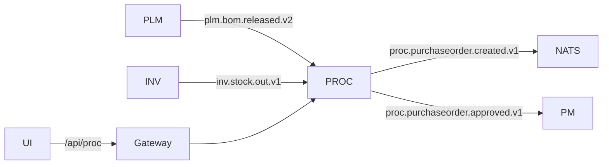

# Faza 3 — Procurement & MRP Light

**Status:** Pilotaż zamknięty (~72% M01) — [FAZA3-CLOSURE.md](./FAZA3-CLOSURE.md)  
**Poprzednia faza:** [FAZA2-CLOSURE.md](./FAZA2-CLOSURE.md)

---

## Cele

1. Automatyczne PO z braków magazynowych (`inv.stock.out.v1`)
2. Szkice PO z released BOM (`plm.bom.released.v2` → MRP)
3. Zatwierdzenie PO → aktualizacja WBS w PM
4. Spójny tor przez Gateway + Outbox relay

---

## Zrealizowane (SILENT-66 … SILENT-70)

| Tor | Event / API | Efekt |
|-----|-------------|--------|
| MRP | `plm.bom.released.v2` | Draft PO `source: MRP` |
| Shortage | `inv.stock.out.v1` | PO `source: SHORTAGE` + `bomComponentId` |
| Outbox | `proc.purchaseorder.*` | Relay NATS co 3s |
| Approve | `PATCH /api/proc/orders/:id/approve` | Outbox → PM WBS `PROCUREMENT_APPROVED` |
| UI | `/proc` | SKU, source, approve/reject |
| Gateway | `/api/proc` | Proxy → :4004 |

---

## Kolejka (zamknięte SILENT-70–72)

- [x] `proc.material.received.v1` → INV receipt
- [x] Finance commitment na `proc.purchaseorder.approved.v1`
- [x] `FAZA3-CLOSURE.md`, `smoke:faza3:live` (SKIP-safe)

---

## Smoke / testy

```bash
npm run smoke:proc          # payload SHORTAGE → PO shape
npm run smoke:faza3         # pełny łańcuch kontraktów Faza 3
./scripts/docker-faza3-smoke.sh --infra-only
pnpm exec jest test/faza3-proc-chain.contract.spec.ts
```

---

## Architektura (skrót)


