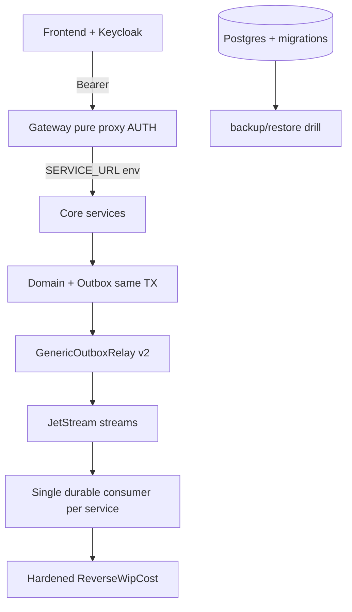
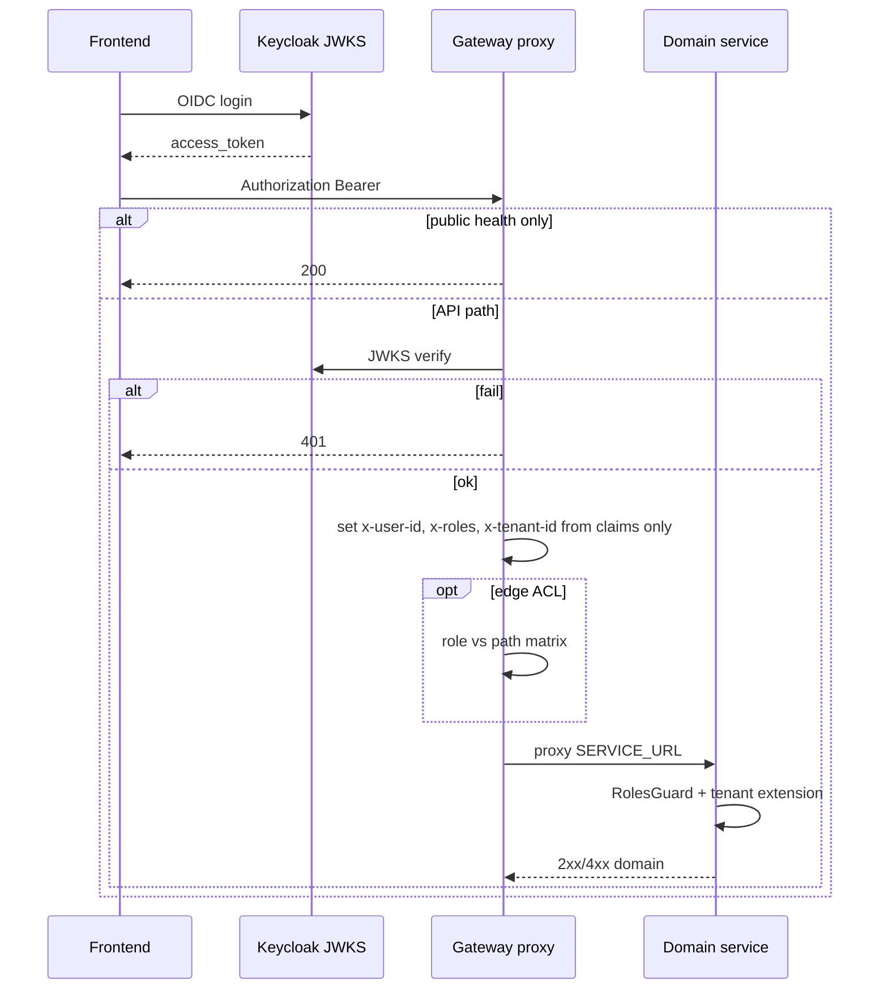
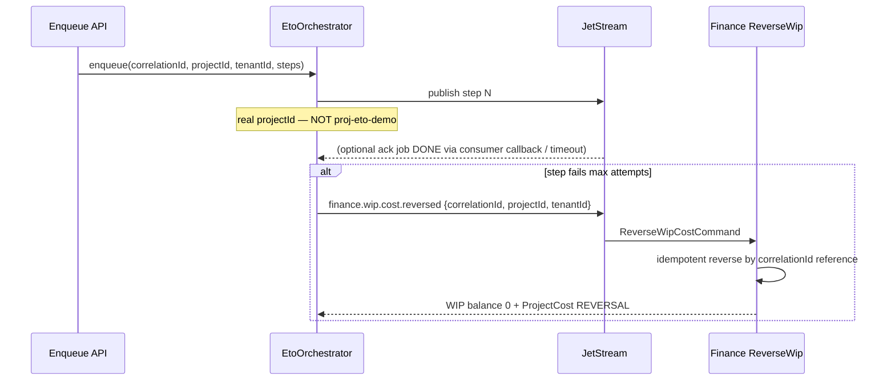
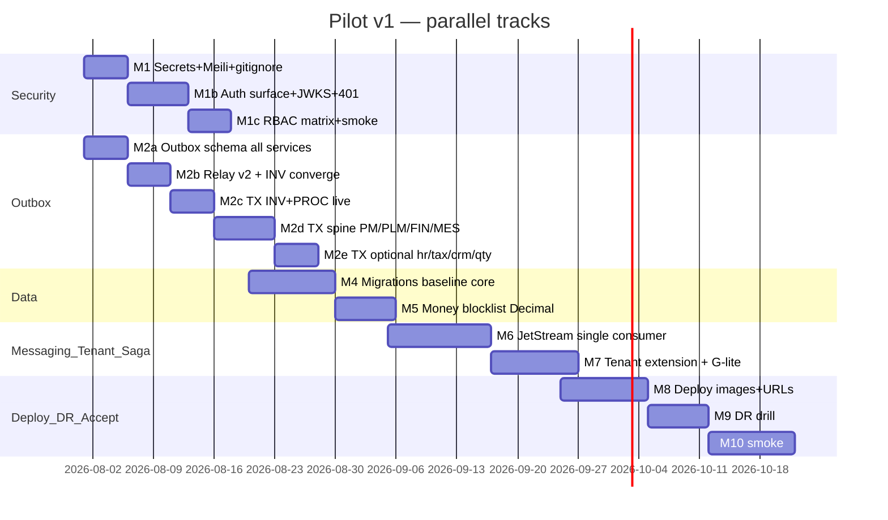
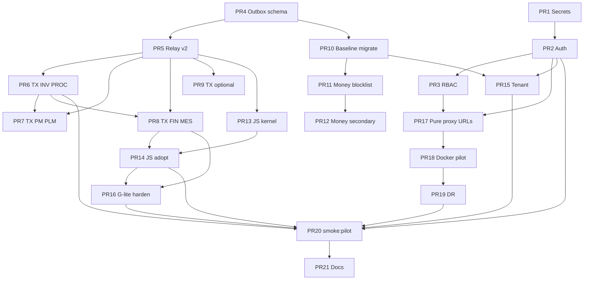

# Pilot v1 Hardening — ERP Composable 2026

| Pole | Wartość |
|------|---------|
| **Dokument** | Pilot v1 Hardening Design |
| **Repo** | `/home/bogdan-mazur/PROGRAMY/ERP/erp-composable-2026` |
| **Autor** | erp-architect (swarm design pass) |
| **Data** | 2026-08-01 |
| **Status** | **Approved** (rev. 4 + user OQ decisions) |
| **Poziom startowy** | Advanced POC / sales demo enterprise — **NIE production** |
| **Cel** | Pilot v1: twardy, single-tenant-per-deployment system gotowy do pilota u klienta |

---

## Overview

Repozytorium `erp-composable-2026` to monorepo NestJS/Prisma z ~15 serwisami domenowymi, API Gateway (Fastify + hybrydowe Nest controllers), frontendem Next.js oraz bogatą warstwą „readiness” w `analytics-service`. Dokumentacja (`docs/PROJECT-STATE.md`) raportuje **Faza 28 / W142 FINAL** z kontraktami 130/130. Audyt i weryfikacja kodu (2026-08-01, rev. 2) pokazują: **system jest demo-ready, nie pilot-ready**.

**Propozycja:** 90-dniowy hardening do **Pilot v1** w modelu **single-tenant per deployment** (jedna organizacja na stack; `tenantId` jako twardy filtr wierszowy z claim JWT). Plan: sekrety + dual-path gateway auth, schema-aligned transactional outbox, money Decimal na polach pilot-critical, migracje Prisma, JetStream (jedna ścieżka konsumencka), G-lite saga z real correlationId, deploy + DR drill, live test suite.

**Założenie capacity (timeline):** 1–2 senior engineers full-time; Security track i Outbox track **równolegle** po PR 1. Bez równoległości sekwencja M1–M4 przekracza 30 dni — patrz Rollout.

---

## Background & Motivation

### Co system już ma (wartość biznesowa)

- Spine ETO: PLM → PM → INV → MES → Finance (`apps/shared-kernel/src/types/eto-saga.ts`).
- Cluster Manufacturing + Finance + Tax (KSeF sandbox) + PROC/Quality/EAM (pilotaż).
- ADR-001…007, Event Registry, Keycloak realm, docker-compose multi-Postgres (ADR-003).
- Outbox model + **dwa warianty relay**: `GenericOutboxRelay` (shared-kernel) oraz lokalny `InvOutboxRelayService`.
- **Handler kompensacji WIP istnieje:** `apps/finance/src/commands/reverse-wip-cost.handler.ts` + `@EventPattern('finance.wip.cost.reversed')` w `finance.controller.ts` — jakość poniżej pilotu (patrz niżej).
- Skrypty `scripts/backup-dbs.sh` / `scripts/restore-dbs.sh` (surowy DR, bez drill).

### Dlaczego to nie jest Pilot v1

| Obszar | Stan w kodzie | Ścieżka |
|--------|---------------|---------|
| Auth dual-path | **Proxy path** (CRM/PM/INV/PROC/MES/analytics…): auth tylko `onRequest` + `PUBLIC_PATH_PREFIXES`. **Nest controllers** (HR/PLM/FIN/Quality/EAM/Tax): `JwtAuthGuard`/`RolesGuard`; `ProcController` **nie jest** w `AppModule` (martwa ścieżka; PROC idzie proxy) | `apps/api-gateway/src/main.ts`; `app.module.ts` |
| Public proxy surface | Krytyczne: `/api/analytics/*` (platform, import, export, outbox…), `/api/mes/kiosk`, `/api/ai` — **pełny unauthenticated proxy**. Nest-path `/api/hr` na allowlist **pomija claim injection**, ale sam guard Nest nadal wymaga JWT | `main.ts` L9–36, L66–91 |
| Guard JWT | Bypass przy `AUTH_DISABLE=true`; secure-by-default `AUTH_ENFORCE !== 'false'` | `jwt-auth.guard.ts`; `main.ts` L66/L99 |
| Multi-tenancy | `isolatedClient` → `return query(args)` **no-op** (CRM, PM). Inne serwisy **nie mają** isolatedClient | `crm-service` / `pm-service` `prisma.service.ts` |
| Outbox INV | Poza `$transaction`; `.catch(() => {})`; lokalny relay `emit()` bez await → PROCESSED | `reserve-material.handler.ts`; `inv-service/.../outbox-relay.service.ts` |
| GenericOutboxRelay | `lastValueFrom(emit)` ≠ durable ack; ustawia status **`IN_PROGRESS`** — **nie ma w enum** Prisma (`PENDING\|PROCESSED\|FAILED`) | `shared-kernel/src/outbox-relay.ts` L27–29; wszystkie `schema.prisma` |
| Outbox columns | `attempts`/`lastError` tylko inv/proc/quality (+ analytics jobs); brak na finance/pm/plm/mes/hr/tax/crm | per-service prisma |
| JetStream | conf ON; app = Nest `Transport.NATS` core | `infra/nats/nats.conf`; serwisy `main.ts` |
| Money | Finance **Decimal** OK; monetary **Float** w tax/pm/plm/proc/hr/crm + INV genealogy | patrz KD-5 |
| Migracje | Brak `prisma/migrations`; script → `db push` | `scripts/prisma-migrate-deploy.sh` |
| Secrets | Keys na dysku; **Meili master key hardcoded** w gateway; PM DB URL hardcoded; `backups/` **nie** w `.gitignore` | `main.ts` L210; `pm-service/prisma.service.ts`; `.gitignore` |
| Dockerfile | `tsc \|\| true`; `EXPOSE 3000` vs listen **4005** | root `Dockerfile` |
| Gateway bind | `listen(4005, '127.0.0.1')` (log kłamie o 0.0.0.0) | `main.ts` L247–248 |
| Saga / Temporal | `proj-eto-demo`; Temporal = TCP; reverse handler **istnieje** ale `mock-wip-account-id`, słaba idempotencja, nested `commandBus` w TX | orchestrator; `reverse-wip-cost.handler.ts` |
| Roles | `ERP_ROLES` analytics ≠ pełny realm (PLANNER, PRODUCTION_MANAGER) ≠ aliasy w guards (MAINTENANCE, SUPERVISOR, WAREHOUSE) | Keycloak + controllers |
| Readiness / contracts | ~130 readiness + `fs.existsSync`; self-assert literałów | analytics-service; contract specs |
| CI | `\|\| true` w autonomous pipelines | `scripts/autonomous-*.sh` |

### Korekty względem starych notatek audytu (rev. 2)

| Stara teza | Stan faktyczny |
|------------|----------------|
| Auth opt-in `AUTH_ENFORCE !== 'true'` | Częściowo naprawione: default-on + `AUTH_DISABLE`; dziura = public **proxy** prefixes |
| X-Dev-Role ADMIN backdoor | **Nie występuje** (domyślnie VIEWER w auth.service) |
| Finance amounts Float | Schema finance = **Decimal** |
| pm/finance/hr/tax **brak** relay | Relay **jest** (GenericOutboxRelay); jakość/schema enum gorsza niż INV custom |
| `finance.wip.cost.reversed` — brak handlera | **FAŁSZ** — handler + `@EventPattern` istnieją; wymaga **harden**, nie greenfield |
| Zero backup | Skrypty dump/restore istnieją; brak drill / `backups/` gitignore |
| Keys w git | gitignored; pliki na dysku; Meili key w kodzie |

### Pain points

1. Public **proxy** surface (analytics/platform/import) = unauthenticated data plane.
2. Dual gateway (proxy vs Nest) + claim injection tylko na proxy-auth path.
3. Outbox dual-write + invalid `IN_PROGRESS` + dwa relay implementations.
4. „100% regression” = theater, nie pilot gate.
5. Deploy: loopback, jeden Dockerfile, port mismatch EXPOSE/listen.

---

## Goals & Non-Goals

### Goals

1. Security baseline: auth ON; zero secrets in tree/code; dual-path gateway **ujednolicony**; RBAC na mutacjach ETO.
2. Reliability: outbox schema alignment → transactional writes → relay v2 (jedna implementacja) → JetStream.
3. Data integrity: pilot-critical money → Decimal; migracje (nie push) dla core.
4. Tenancy: single-tenant-per-deploy + real row filter (defense-in-depth, nie SaaS).
5. G-lite saga: real correlationId; hardened reverse WIP; compensation set w zakresie.
6. Deploy + DR drill; honest live suite `smoke:pilot`.

### Non-Goals

- DMS full; Faza 29+; SaaS multi-region; ISO; Pact broker full; iot-ai full; Temporal workers; mTLS mesh prod.
- Usunięcie całej warstwy readiness analytics (hałas akceptowany residual — nie w pilot gate).
- Konwersja **wszystkich** Float w monorepo (tylko pilot-critical — patrz KD-5).

---

## Current State vs Target

| Wymiar | Dziś | Pilot v1 (D90) |
|--------|------|----------------|
| Poziom | Sales demo / POC | Single-customer pilot |
| Auth | Dual path; public **proxy** analytics/* | Jedna reguła auth; public = health (+ OIDC); JWKS required |
| Gateway routing | Hybrid proxy + Nest controllers; dead ProcController | **KD-8: pure env-based proxy** (Nest domain controllers usunięte lub cienkie aliasy) |
| Secrets | Keys on disk; Meili in source; PM URL hardcode | Env/Secret only; gitignore `backups/` |
| Tenancy | no-op CRM/PM | Shared `tenant-extension`; worker identity; filter on tenantId models |
| Outbox | Dual relay; invalid IN_PROGRESS; partial attempts | Canonical enum PROCESSING; attempts/lastError wszędzie; one relay v2 |
| NATS | Core only | JetStream ETO streams; **one consumer path** (no dual Nest+JS) |
| Money | Finance Decimal; many cost Floats | Pilot-critical Decimal; residual Float documented |
| Schema | db push | migrate deploy (PILOT=1 forbids push) |
| Saga | demo projectId; reverse exists but fragile | G-lite + hardened reverse + live fail-at-WIP |
| Testy | theater contracts | `pnpm run smoke:pilot` live |
| Deploy | 127.0.0.1; EXPOSE 3000; gateway-only image | 0.0.0.0; PORT; multi-image; compose profile pilot |
| DR | scripts only | drill script + measured RTO |

### As-is (messaging + gateway)

```mermaid
flowchart TB
  FE[Frontend] --> GW[API Gateway]
  GW -->|fastifyHttpProxy + PUBLIC list| AN[analytics unauthenticated]
  GW -->|proxy auth onRequest| PM[pm/inv/crm...]
  GW -->|Nest controllers + JwtAuthGuard| HR[hr/plm/fin...]
  PM --> OB[(Outbox mixed)]
  OB --> REL1[InvOutboxRelay local]
  OB --> REL2[GenericOutboxRelay IN_PROGRESS invalid]
  REL1 --> NATS[NATS core]
  REL2 --> NATS
  NATS -.-> JS[JetStream unused]
  FIN[finance] -->|@EventPattern reverse exists| NATS
```

### Target Pilot v1



---

## Key Decisions

### KD-1: Auth default-on + pilot JWKS

Auth **ON** by default. Forbidden in pilot profile: `AUTH_ENFORCE=false`, `AUTH_DISABLE=true`, missing JWKS when `USE_KEYCLOAK_JWKS` required.

- Public surface **ranked by transport**:
  - **P0 (critical unauthenticated proxy):** `/api/analytics/platform`, `/import`, `/export`, `/outbox`, `/auth` (non-OIDC), `/tenants`, … — shrink first.
  - **P1:** `/api/mes/kiosk`, `/api/ai` — device token or remove from public.
  - **P2 (Nest path):** `/api/hr` na allowlist **nie** otwiera HR bez JWT (guard Nest), ale **psuje claim injection** jeśli kiedykolwiek proxy — usunąć z listy i trzymać wyłącznie Nest/proxy spójnie.
- Pilot: `USE_KEYCLOAK_JWKS=true` + ready probe live JWKS fetch; HS256/`JWT_SECRET` only local non-pilot.
- Reject `alg=none` via library + explicit tests.

### KD-2: Single-tenant per deployment

Jedna org na stack. `tenantId` z JWT; shared-kernel `tenant-extension.ts` **jedyna** implementacja filtrów. Cross-tenant smoke z dwoma tenantId w jednej DB = **defense-in-depth** (mis-seed / błąd konfiguracji), **nie** produkt multi-tenant.

Worker/NATS: **nie** REQUEST-scoped Prisma; `AsyncLocalStorage` lub explicit `tenantId` z payloadu eventu. Identity system jobs: `tenantId` z eventu lub `DEFAULT_TENANT_ID` — **nie** odrzucać `system-tenant` w workerze bez ścieżki systemowej (patrz §4).

### KD-3: Outbox schema → relay v2 → JetStream

1. Align OutboxEvent schema (PROCESSING + attempts + lastError) **all producers**.
2. Relay v2 + transactional writes.
3. JetStream publish/consume; flag `NATS_JETSTREAM`.

Ban: string `'IN_PROGRESS'` — tylko enum `PROCESSING` zgodny z Prisma.

### KD-4: Saga G-lite (nie Temporal)

Rozwijamy orchestrator + hardened reverse. Temporal TCP zostaje optional status, **nie** DoD.

**In-scope compensation (pilot):**

| Step failure context | Compensation event | Handler |
|---------------------|--------------------|---------|
| After WIP recorded / orchestrator fail | `finance.wip.cost.reversed` | **Harden** existing `ReverseWipCostHandler` |
| Reservation created, chain abort | `inventory.reservation.released.v1` (or restore) | existing INV path if present; else document gap |

**Out-of-scope compensation:** full reverse BOM unrelease, MES reverse production, all COMPENSATION_ACTIONS map — residual R5.

### KD-5: Money — pilot-critical Decimal policy

| Klasa | Pola (przykłady) | Pilot |
|-------|------------------|-------|
| **Blocklist (must Decimal)** | finance `amount`/`balance`/`wip*`; tax-legal `TaxInvoice.amount`; proc `unitPrice`/`landedUnitCost`/`freightCost`/`customsDuty`; pm `budget`/`baselineCost`/`actualLaborCost`/`targetRevenue`; hr `hourlyRate` (feeds WIP labor) | Migracja + gate |
| **Secondary** | plm `standardCost`; CRM `value`/`price`/`basePrice` | **PR 12** optional / residual jeśli poza core image |
| **Allow non-money Float** | plm `weightKg`, `scrapFactor`, BOM `quantity` (engineering qty), pm `ccpmBufferPct`, `units` FTE, timesheet `hours` (time not currency) | OK residual; gate excludes by allowlist |

Gate `check-no-float-money.sh` = **blocklist paths**, nie „any Float in repo”.

### KD-6: Honest DoD — live tests only

No `fs.existsSync` readiness, no literal self-assert, no `|| true` on pilot gates.

### KD-7: Deploy — compose pilot primary

`docker compose --profile pilot` primary; K8s staging secondary.

### KD-8: Gateway unification — pure proxy (fixes TD-002 hybrid)

**Decyzja:** **(A) wszystkie domeny przez env-based `fastifyHttpProxy` + jeden `onRequest` auth boundary.** Nest domain controllers (HR/PLM/FIN/Quality/EAM/Tax) **usuwamy lub zamieniamy na re-export health** w **PR 17**; RolesGuard przenosimy **downstream** (PR 3) lub thin gateway ACL map prefix→roles w onRequest (opcjonalnie).

**Uzasadnienie:** Dziś dwa światy uniemożliwiają spójne claim injection i PUBLIC list semantics. Pure proxy = jedna ścieżka, env URLs, RBAC w serwisach (defense-in-depth) + opcjonalna ACL na edge.

**Odrzucone (B) all Nest controllers:** więcej kodu per route, gorsze parity z istniejącym proxy CRM/PM/INV.

**Dead code:** `ProcController` nie w `AppModule` — **usunąć** w **PR 17** (PROC już proxy).

---

## Proposed Design

### 1. Security & gateway (KD-1, KD-8)



**PR 1 secrets includes:** workspace keys purge; PM URL; **Meili `MEILI_MASTER_KEY` env** (remove hardcoded `erp-meili-master-key-2026`); `backups/` gitignore; threat table.

### 2. Outbox — schema then relay

**Canonical OutboxEvent (all producers):**

```prisma
enum OutboxStatus {
  PENDING
  PROCESSING  // NOT IN_PROGRESS — must match Prisma enum
  PROCESSED
  FAILED
}

model OutboxEvent {
  id            String       @id @default(uuid())
  tenantId      String
  aggregateId   String?
  aggregateType String?
  eventType     String
  payload       Json
  status        OutboxStatus @default(PENDING)
  attempts      Int          @default(0)
  lastError     String?
  createdAt     DateTime     @default(now())
  processedAt   DateTime?
  @@index([status, createdAt])
  @@index([tenantId, status])
}
```

**Relay v2 algorithm:**

1. Claim: `PENDING` → `PROCESSING` (conditional update / SKIP LOCKED).
2. Publish (NATS core or JetStream ack).
3. Success → `PROCESSED`; fail → `attempts++`, back to `PENDING` or `FAILED` at max.
4. Metrics hooks optional (best-effort — residual observability).
5. **INV:** delete `InvOutboxRelayService` **lub** thin subclass of GenericOutboxRelay v2 only — no dual semantics (PR 5).

**Transactional write:**

```typescript
await prisma.$transaction(async (tx) => {
  await tx.reservation.create({ data: reservation });
  await tx.outboxEvent.create({ data: { /* PENDING */ } });
});
// never .catch(() => {}) on outbox
```

### 3. JetStream (after outbox solid)

| Stream | Subjects (NATS wildcards) | Durable consumers (examples) |
|--------|---------------------------|------------------------------|
| `ETO_CORE` | `plm.>`, `pm.>`, `inventory.>`, `mes.>`, `finance.wip.>` | `fin-wip-worker`, `inv-eto-worker`, `mes-eto-worker` |
| `SUPPLY` | `inv.stock.>`, `proc.>` | `proc-supply-worker` |
| `QUALITY` | `quality.>`, `eam.>` | `quality-worker` |

**Event → stream map (ETO spine):**

| Event type | Stream | Consumer durable | Handler (pilot) |
|------------|--------|------------------|-----------------|
| `plm.bom.released.v2` | ETO_CORE | `inv-eto-worker` / `pm-…` | existing listeners |
| `pm.material.requested.v1` | ETO_CORE | `inv-eto-worker` | INV |
| `inventory.reservation.created.v1` | ETO_CORE | (downstream as needed) | |
| `mes.workorder.planned` | ETO_CORE | `mes-eto-worker` | |
| `mes.production.recorded.v1` | ETO_CORE | | |
| `inventory.reservation.released.v1` | ETO_CORE | `fin-wip-worker` | Finance WIP record |
| `finance.wip.cost.recorded` | ETO_CORE | analytics chain / orchestrator | |
| `finance.wip.cost.reversed` | ETO_CORE | `fin-wip-worker` | `ReverseWipCostHandler` |
| `inv.stock.out.v1` | SUPPLY | `proc-supply-worker` | PROC |

**Coexistence rule (pilot):** **jedna** ścieżka konsumencka na subject. Przy `NATS_JETSTREAM=true` wyłączyć Nest `@EventPattern` subscribe dla tych subjectów **albo** nie uruchamiać JS consumer — **zakaz dual subscribe** (double-delivery). Prefer: native JS consumer wrapper w shared-kernel; Nest patterns off for migrated subjects.

**Retention:** limits 7d / 1GB; outbox PROCESSED jest source of truth dla „wysłano”; JS replay = recovery, nie second outbox.

**Bootstrap:** `scripts/nats-bootstrap-streams.sh` idempotent `stream add` / `consumer add`.

### 4. Tenancy

**Shared only:** `apps/shared-kernel/src/tenant-extension.ts`.

**Models with tenantId (core — enforce filter):** PM Project/WBS/…, INV stock/reservation/outbox, FIN journal/wip/projectCost, PROC PO, PLM as applicable, quality NCR, etc.

**Models without tenantId:** rare system tables — whitelist; outbox ma `tenantId`.

**Operations covered:**

| Operation | Tenant strategy |
|-----------|-----------------|
| `findMany`, `findFirst`, `count`, `aggregate`, `updateMany`, `deleteMany` | Merge `where: { ...args.where, tenantId }` |
| `create` / `createMany` | Force `data.tenantId = current` (createMany: map each row) |
| **`findUnique`** | **Do not inject `tenantId` into unique where** (Prisma allows only unique fields; models use `@id` on `id` alone, not `@@unique([id, tenantId])`). **Rewrite to `findFirst({ where: { id, tenantId } })`** inside the extension (same client API surface if using custom wrapper, or middleware that replaces the call). Returning row from wrong tenant must be impossible. |
| **`upsert`** | Prefer `findFirst` + `update`/`create` with tenant; or `updateMany` where `{ id, tenantId }` then create if count=0. Do not use id-only `findUnique` without tenant re-check. |
| `update` / `delete` by id | After load: verify `record.tenantId === current` **or** use `updateMany`/`deleteMany` with `{ id, tenantId }` and require `count === 1` |
| Relations / `$queryRaw` | Parent where + app checks; raw SQL **forbidden** without bound `tenantId` |

**Unit-test DoD (PR 15):** seed id=X for tenant A and tenant B; `findUnique`/read path under tenant A context never returns B’s row (null or A-only).

**Workers:**

```typescript
// NATS handler — no HTTP REQUEST scope
runWithTenant(event.tenantId || process.env.DEFAULT_TENANT_ID, () => handler(event));
```

`system-tenant` allowed **only** when `ALLOW_SYSTEM_TENANT=true` (migrate/seed jobs), not for user HTTP.

**Phase 2 DoD two-tenant test:** seeded rows tenant A/B in same Postgres; JWT A cannot read B — **defense-in-depth safety net**, not multi-tenant product.

### 5. Saga G-lite — success criteria



**Live asserts (PR 16 G-lite / `scripts/smoke-saga-compensation.ts`):**

1. Happy: enqueue real ids → jobs DONE → WIP row exists for `projectId`.
2. Fail-at-WIP: force publish fail or mark job FAILED → reverse event → `projectCost` type REVERSAL with `reference=correlationId`; second reverse is no-op (idempotent).
3. No hard-coded `proj-eto-demo` in publish path (grep gate).
4. `EtoChainService.ingestEvent`: NATS/JS consumer (not only analytics HTTP demo) for pilot path.

**Reverse handler harden checklist:** remove `mock-wip-account-id`; no nested `commandBus.execute` inside outer `$transaction` (use same `tx` or reorder); idempotency on `correlationId` / reference; `.catch(() => {})` removed on orchestrator compensation publish (log + metric).

### 6. Role matrix (KD-1 / PR 3)

Canonical roles = **Keycloak realm** `infra/keycloak/realm-erp.json`:  
`ADMIN`, `ENGINEER`, `INSPECTOR`, `ACCOUNTANT`, `PROCUREMENT`, `PLANNER`, `PRODUCTION_MANAGER`, `VIEWER`.

| Role | ETO / pilot mutations |
|------|------------------------|
| ADMIN | all |
| ENGINEER | PLM BOM release, PM structure |
| PLANNER | PM plan; PROC read; alias for planning |
| PROCUREMENT | PO create/approve |
| PRODUCTION_MANAGER | MES start/finish; HR labor approve |
| ACCOUNTANT | Finance post/WIP; Tax invoice |
| INSPECTOR | Quality NCR/CAPA |
| VIEWER | GET only — **deny all writes** |

**Aliases in code to map or remove:** `WAREHOUSE` → treat as INV write role (add to realm **or** map to PRODUCTION_MANAGER); `MAINTENANCE` → map ENGINEER or add realm role; `SUPERVISOR` → PRODUCTION_MANAGER. PR 3: single map module `ERP_ROLE_ALIASES`; smoke VIEWER-denied + one writer per domain (ENGINEER, PROCUREMENT, ACCOUNTANT, PRODUCTION_MANAGER).

### 7. Observability

Metrics list (outbox_pending/failed, 401 rate, saga failed) = **best-effort residual** unless PR 5 (relay v2) includes optional counters. **No separate metrics PR required for Pilot DoD.** Alert wiring = residual R-OBS. Structured logs: `correlationId`, `tenantId`, `userId` on mutations (enforced in code review, not separate PR).

### 8. Compose pilot inventory

#### Port conflicts (as-is) — must fix in PR 17/18

| Port | Service A (keep) | Service B (collides today) | Evidence |
|------|------------------|----------------------------|----------|
| **4008** | `quality-service` (`main.ts` listen 4008); gateway quality Nest → `:4008` | `search-service` also listen **4008**; gateway `/api/ai` → `:4008` | quality + search cannot co-bind |
| **4009** | `eam-service` (`main.ts` listen 4009); gateway eam Nest → `:4009/eam` | `approvals-service` also listen **4009**; gateway `/api/approvals` → `:4009` | eam + approvals cannot co-bind |

**Pilot port assignment (target):**

| App / process | Port | DB container | DB name | Env URL (gateway→svc) | Pilot profile |
|---------------|------|--------------|---------|------------------------|---------------|
| api-gateway | 4005 | — | — | — | **min** |
| crm-service | 4001 | erp-crm-db | crm_db | CRM_SERVICE_URL | optional |
| pm-service | 4002 | erp-pm-db | pm_db | PM_SERVICE_URL | **min** |
| inv-service | 4003 | erp-inv-db | inv_db | INV_SERVICE_URL | **min** |
| proc-service | 4004 | erp-proc-db | proc_db | PROC_SERVICE_URL | **min** |
| mes-service | 4006 | erp-mfg-db | mfg_db | MES_SERVICE_URL | **min** |
| plm-service | 4007 | erp-plm-db | plm_db | PLM_SERVICE_URL | **min** |
| quality-service | **4008** | erp-quality-db | quality_db | QUALITY_SERVICE_URL | optional |
| eam-service | **4009** | erp-eam-db | eam_db | EAM_SERVICE_URL | optional |
| finance | 4010 | erp-fin-db | fin_db | FIN_SERVICE_URL | **min** |
| analytics-service | 4011 | erp-analytics-db | analytics_db | ANALYTICS_SERVICE_URL | **min** |
| hr | 4012 | erp-hr-db | hr_db | HR_SERVICE_URL | optional |
| tax-legal | 4015 | erp-tax-db | tax_legal_db | TAX_SERVICE_URL | optional |
| **search-service** | **4018** (reassign from 4008) | — | — | SEARCH_SERVICE_URL | **out of pilot min** |
| **approvals-service** | **4019** (reassign from 4009) | — | — | APPROVALS_SERVICE_URL | **out of pilot min** |
| nats | 4222 | volume js data | — | NATS_URL | **min** |
| keycloak | 8080 | — | — | USE_KEYCLOAK_JWKS | **min** |
| meilisearch | 7700 | — | — | MEILI_* | optional (search UI) |
| frontend | 3000 | — | — | — | **min** |

**Rules:**

1. **quality keeps 4008, eam keeps 4009** (existing Nest controllers + optional pilot services).
2. **search-service → 4018**, **approvals-service → 4019** in code (`main.ts` + gateway proxy env defaults) in **PR 17**.
3. Pilot **minimum** does **not** start search/approvals; even so, reassignment prevents footgun if a full stack boot is attempted.
4. Gateway pure-proxy map: `QUALITY_SERVICE_URL`, `EAM_SERVICE_URL`, `SEARCH_SERVICE_URL=http://search-service:4018`, `APPROVALS_SERVICE_URL=http://approvals-service:4019`.

**Profile `pilot` minimum image set (default OQ-6):**  
gateway, pm, inv, plm, mes, finance, proc, analytics, keycloak, nats, postgres×needed, frontend.  
**Optional:** crm, hr, tax, quality, eam.  
**Out of pilot min (re-ported, not required):** search-service, approvals-service.

Multi-Postgres **remains** (ADR-003).

---

## API / Interface Changes

| Before | After |
|--------|-------|
| Hybrid proxy + Nest controllers | Pure proxy (KD-8) |
| Large PUBLIC analytics proxy | Public: `/health`, `/api/analytics/health` only (+ OIDC if any) |
| Meili key in source | `MEILI_MASTER_KEY` env |
| `listen(4005,'127.0.0.1')` | `PORT` + `0.0.0.0` |
| EXPOSE 3000 | EXPOSE 4005 (gateway image) |
| Token missing → often 200 via proxy public | **401** |

**DoD 401 targets (P0):** `/api/analytics/platform` (any readiness), `/api/analytics/import`, `/api/pm/projects`, `/api/inv` (protected route).

**Env pilot (required):**

```bash
AUTH_ENFORCE=true
AUTH_DISABLE=false
USE_KEYCLOAK_JWKS=true
DEFAULT_TENANT_ID=acme
NATS_URL=nats://nats:4222
NATS_JETSTREAM=true   # after M6
OUTBOX_MAX_ATTEMPTS=5
MEILI_MASTER_KEY=...  # not in git
PILOT=1
PORT=4005
# *_SERVICE_URL=http://<svc>:<port>
```

---

## Data Model Changes

1. **PR 4:** outbox enum/columns alignment migrations (all producers) — **before** relay v2 code (PR 5).
2. **PR 10:** full baseline migrations for remaining schema (or fold baseline into service-by-service after outbox mig).
3. Strategy baselining: prefer `prisma migrate diff` against empty DB from current `schema.prisma` (reproducible). Existing demo DBs: backup → `migrate resolve --applied` after parity check. **Not** silent `db pull` as source of truth.
4. Money migrations per KD-5 blocklist (**PR 11** pilot-critical; **PR 12** secondary optional).
5. `PILOT=1` → `prisma-migrate-deploy.sh` **fails** if would use db push.

---

## Alternatives Considered

| ID | Option | Verdict |
|----|--------|---------|
| A1 | Shared multi-tenant SaaS | ❌ leak risk / scope |
| A2 | Temporal day 1 | ❌ TCP-only, ops cost |
| A3 | Kafka | ❌ ADR-002 NATS |
| A4 | Central outbox service | ❌ breaks DB-per-service |
| A5 | Auth only gateway, no service guards | ❌ direct pod access |
| **A6** | Pure proxy vs all Nest controllers | **✅ pure proxy (KD-8)** |
| **A7** | Keep readiness theater vs delete | **Quarantine from pilot gate; delete later** (noise residual) |
| **A8** | Shared OutboxStatus package vs copy enum | Copy enum per schema OK; **values must match**; optional shared zod/const |
| **A9** | Baseline via migrate diff empty vs db pull live | **✅ migrate diff empty**; db pull only forensic |

---

## Security & Privacy Considerations

| Threat | Sev | Mitigation |
|--------|-----|------------|
| Unauth analytics proxy | Critical | Shrink PUBLIC; 401 live on platform/import |
| Spoofed headers | High | Strip + only set from JWT |
| Secrets on disk / Meili in code | Critical | PR 1 purge + env |
| Hardcoded PM DB password | High | env only |
| Dual gateway claim skip | High | KD-8 pure proxy |
| Cross-tenant read | Medium | filter + single-tenant deploy |
| Invalid outbox status | High | schema PR 4 |
| Money float drift | Medium | KD-5 blocklist |
| JWT HS256 / no JWKS in pilot | High | require JWKS; CI fail |
| alg=none | Medium | explicit test |

---

## Observability

Best-effort counters on relay v2; **Pilot DoD does not require** Prometheus rule deploy. Residual: R-OBS.

---

## Rollout Plan (30 / 60 / 90)

**Parallel swimlanes (1–2 engineers):**



| Milestone | Outcome |
|-----------|---------|
| M1 | Secrets gone; Meili env; backups/ ignored |
| M1b | PUBLIC shrunk; JWKS pilot; 401 on P0 paths |
| M1c | Role matrix + VIEWER deny |
| M2a–e | Schema → relay v2 → TX slices |
| M3 | Intermediate: `smoke:pilot:outbox` + auth green (after M2c+M1b) |
| M4–M5 | Migrations + money |
| M6–M7 | JS + tenant + saga |
| M8–M10 | Deploy, DR, full suite |

### Phase DoD (tightened)

**Phase 1 (D1–30) — live:**

1. No token: `GET /api/analytics/platform/*` and `GET /api/pm/projects` → **401** (not 200).
2. Token `demo.engineer` (ENGINEER): `GET /api/pm/projects` → **200** or **404** (empty); **not** 401/403/5xx from auth stack. 5xx = fail.
3. INV reservation create → outbox row same TX; ≤5s **PROCESSED**; message observed (NATS sub or JS).
4. Repo root secret scan: no `*.key`, no `cluster-keys.json`, no Meili hardcoded string; `backups/` gitignored.
5. Core services: `PILOT=1 pnpm run db:migrate:deploy` without push fallback for outbox-aligned services.
6. CI pilot: fail if `AUTH_ENFORCE=false` or `USE_KEYCLOAK_JWKS!=true`.

**Phase 2:**

1. Stream `ETO_CORE` has messages after smoke (bootstrap script; CI image includes `nats` CLI **or** HTTP monitoring `:8222` assert via curl — **prefer curl to nats monitor** to avoid CLI dep).
2. NATS restart + volume → consumer lag clears.
3. Tenant A JWT cannot read B rows (two seeds).
4. Fail-at-WIP → reverse applied + idempotent second call.
5. `check-no-float-money.sh` (blocklist) exit 0.
6. `pnpm run smoke:pilot:eto` green.

**Phase 3:**

1. `docker compose --profile pilot up` healthy + smoke.
2. Gateway env URLs ≠ 127.0.0.1 in staging compose/k8s.
3. `scripts/dr-drill.sh` measured RTO documented (default target **2h**, RPO **24h** — OQ-4).
4. `pnpm run smoke:pilot` full green.
5. UI ETO path as **demo.engineer** (not ADMIN).

**Flags:** `AUTH_*`, `NATS_JETSTREAM`, `TENANT_ENFORCE`, `OUTBOX_RELAY_V2`, `PILOT`.

---

## Risks and Residual Risk

| ID | Risk | Sev | Mitigation | Residual |
|----|------|-----|------------|----------|
| R1 | FE break after PUBLIC shrink | High | FE+GW same train | Med |
| R2 | Baseline migrate on demo DBs | High | backup + resolve | Med |
| R3 | JS double-delivery if Nest left on | High | one consumer path rule | Low if enforced |
| R4 | Tenant filter breaks workers | Med | ALS + DEFAULT_TENANT | Low |
| R5 | Partial compensation only | High | in-scope WIP+reservation | **Med accepted** |
| R6 | Secrets history | High | rotate | Low |
| R7 | Single-tenant multi-demo | Low | multi stack | Accepted |
| R8 | G-lite ≠ Temporal | Med | KD-4 | Accepted |
| R9 | Readiness noise | Low | not in gate | Accepted |
| R10 | mTLS out | Med | network isolation | Residual |
| R-MONEY | Non-blocklist Floats | Med | KD-5 secondary residual | Accepted CRM/eng qty |
| R-OBS | Metrics/alerts not in PR plan | Low | best-effort | Accepted |
| R-GW | Pure proxy migration regression | Med | smoke per domain | Med |
| **R-PORT** | quality/search both :4008; eam/approvals both :4009 | High | PR 17 reassign search→4018, approvals→4019; pilot min omits both | Low after PR 17 |

---

## Open Questions

All open questions are **Resolved** by user decision (FINAL). Implementers must not re-open without a new change request.

| ID | Question | Status | Decision | Implements in |
|----|----------|--------|----------|---------------|
| **OQ-1** | Tenant claim name Keycloak? | **Resolved** | JWT/Keycloak claim name = **`tenantId`** | PR 15 |
| **OQ-2** | MES kiosk device token D30 or D60? | **Resolved** | Device token / hardened kiosk path in **D60** (not D30); D30 keeps kiosk out of PUBLIC shrink critical path or behind temporary control until D60 | PR 2 scope (no kiosk device auth in D1–30); D60 follow-on |
| **OQ-3** | Hosting compose VM vs K8s? | **Resolved** | **`docker compose --profile pilot` primary**; K8s/Helm secondary staging only | PR 18 (emphasis compose); PR 17/18 K8s not blocker |
| **OQ-4** | RPO/RTO contract? | **Resolved** | **RPO 24h** (nightly backup) / **RTO 2h** (restore drill target) | PR 19 |
| **OQ-5** | reverse payload Event Registry freeze? | **Resolved** | **Freeze** `finance.wip.cost.reversed` payload contract **before** G-lite harden | PR 16 (pre-req: Event Registry / docs freeze) |
| **OQ-6** | Core image set? | **Resolved** | **§8 minimum** only: gateway, pm, inv, plm, mes, finance, proc, analytics, keycloak, nats, postgres×needed, frontend. Optional/out-of-min as in §8 table | PR 18 |

### User decisions (FINAL)

Recorded 2026-08-01 — binding for Pilot v1:

1. **OQ-1:** `tenantId` (claim name).
2. **OQ-2:** MES kiosk device token → **D60**.
3. **OQ-3:** Hosting → **docker compose pilot primary**.
4. **OQ-4:** **RPO 24h / RTO 2h**.
5. **OQ-5:** Freeze reverse payload before G-lite harden (**yes**).
6. **OQ-6:** Core image set = **table §8 minimum**.

---

## References

- `docs/PROJECT-STATE.md`, `TECHNICAL-DEBT.md`, `PRODUCTION-READINESS.md`, `SECURITY-ROADMAP.md`
- ADR-002, ADR-003, ADR-007
- `apps/shared-kernel/src/outbox-relay.ts`
- `apps/finance/src/commands/reverse-wip-cost.handler.ts`
- `apps/api-gateway/src/main.ts`, `app.module.ts`
- `infra/keycloak/realm-erp.json`, `infra/nats/nats.conf`
- `scripts/prisma-migrate-deploy.sh`, `backup-dbs.sh`, `restore-dbs.sh`

---

## PR Plan

Hard dependencies only: `- **Dependencies:** none` or `- **Dependencies:** PR N, PR M`.  
Recommendations live in Description.  
**Numbering (integer only, execute-plan friendly):** PR 4 = outbox schema; PR 5 = relay v2; PR 6–9 = TX outbox slices (INV+PROC, PM+PLM, FIN+MES, optional producers); PR 10 = baseline migrations; PR 11 = money blocklist; PR 12 = secondary money (optional); PR 13–14 = JetStream; PR 15 = tenant; PR 16 = G-lite; PR 17–19 = deploy/DR; PR 20–21 = smoke + docs.

### PR 1: Security — purge secrets, Meili env, gitignore backups

- **Files/components affected:**
  - Workspace: `cluster-keys.json`, `infra/tls/**/*.key`, `infra/vault/unseal/unseal.key` (purge)
  - `apps/pm-service/src/prisma.service.ts` (remove hardcoded URL/password)
  - `apps/api-gateway/src/main.ts` (Meili `MEILI_MASTER_KEY` env; remove `erp-meili-master-key-2026`)
  - `.gitignore` (`*.key`, `cluster-keys.json`, **`backups/`**)
  - `scripts/security-purge-local-secrets.sh` (new)
  - `scripts/ci-no-secrets.sh` (new; scan `*.key`, cluster-keys, meili hardcoded)
- **Dependencies:** none
- **Description:** Remove private key material from workspace; env-based Meili and PM DB; gitignore backups; CI fails if secrets patterns reappear.

### PR 2: Security — auth surface, JWKS pilot, 401 live on proxy P0

- **Files/components affected:**
  - `apps/api-gateway/src/main.ts` (`PUBLIC_PATH_PREFIXES` shrink; auth hooks)
  - `apps/api-gateway/src/auth/jwt-auth.guard.ts`, `verify-token.ts`
  - `apps/frontend/**` (bearer on former public calls)
  - `scripts/smoke-auth-401.ts` (new): asserts 401 on `/api/analytics/platform`, `/api/analytics/import`, `/api/pm/projects` without token; JWKS path with `demo.engineer`
  - CI pilot env: `USE_KEYCLOAK_JWKS=true`, forbid `AUTH_ENFORCE=false` / `AUTH_DISABLE=true`
- **Dependencies:** PR 1
- **Description:** Rank and shrink public **proxy** surface first (analytics/platform/import). Document Nest vs proxy until **PR 17** pure-proxy unification. Require JWKS in pilot; live 401 suite. FE updated for protected analytics routes.

### PR 3: Security — role matrix and ETO mutation RBAC

- **Files/components affected:**
  - Shared role map (gateway + services): align with `infra/keycloak/realm-erp.json`
  - Alias map: WAREHOUSE/MAINTENANCE/SUPERVISOR → canonical
  - Guards on PLM release, PM material, INV reserve, PROC approve, FIN WIP, MES start
  - `scripts/keycloak-rbac-smoke.sh` / `scripts/smoke-rbac-eto.ts`: VIEWER denied writes; ENGINEER/PROCUREMENT/ACCOUNTANT/PRODUCTION_MANAGER writer paths
- **Dependencies:** PR 2
- **Description:** Publish single role→mutation matrix; smoke VIEWER + four writers. Downstream guards mandatory even after pure proxy.

### PR 4: Outbox — schema alignment PROCESSING + attempts (all producers)

- **Files/components affected:**
  - `apps/*/prisma/schema.prisma` OutboxStatus + OutboxEvent for: inv, proc, quality, finance, pm, plm, mes, hr, tax-legal, crm (+ analytics if applicable)
  - New migrations per service (thin, outbox-only)
  - Ban `IN_PROGRESS` string in codebase (grep gate)
- **Dependencies:** none
- **Description:** Add `PROCESSING` to enum (replace invalid IN_PROGRESS usage); add `attempts`/`lastError` where missing. **Schema before relay code.** Can parallelize with PR 1.

### PR 5: Outbox — GenericOutboxRelay v2 + converge INV local relay

- **Files/components affected:**
  - `apps/shared-kernel/src/outbox-relay.ts` (v2: claim PROCESSING, await publish, attempts, FAILED, no empty catch)
  - `apps/inv-service/src/outbox-relay.service.ts` — **delete or reimplement as subclass of v2 only**
  - Unit tests shared-kernel + inv relay
  - Optional debug counters (best-effort metrics)
- **Dependencies:** PR 4
- **Description:** One relay implementation semantics. INV must not keep fire-and-forget emit→PROCESSED. Uses only valid Prisma enum values.

### PR 6: Outbox — transactional writes INV + PROC + live smoke

- **Files/components affected:**
  - `apps/inv-service/src/commands/reserve-material.handler.ts`, `create-reservation.handler.ts`, `inv-stock-out.helper.ts`, `pm-integration.controller.ts`
  - `apps/proc-service/src/commands/*.handler.ts`
  - Remove `.catch(() => {})` on outbox paths
  - `scripts/smoke-outbox-inv-proc.ts`
- **Dependencies:** PR 5
- **Description:** Domain write + outbox in `$transaction`; live smoke PROCESSED + message bus observe.

### PR 7: Outbox — transactional PM + PLM

- **Files/components affected:**
  - `apps/pm-service/src/**` outbox creates + relay subclass
  - `apps/plm-service/src/**` outbox creates + relay
  - slice smoke
- **Dependencies:** PR 5, PR 6
- **Description:** Spine producers PM/PLM on TX outbox + relay v2. Independently reviewable slice.

### PR 8: Outbox — transactional FIN + MES

- **Files/components affected:**
  - `apps/finance/src/**` outbox + relay
  - `apps/mes-service/src/**` outbox + relay
  - slice smoke
- **Dependencies:** PR 5, PR 6
- **Description:** Finance and MES TX outbox. Enables reliable WIP events for saga later.

### PR 9: Outbox — transactional quality + hr + tax-legal + crm (optional pilot services)

- **Files/components affected:**
  - `apps/quality-service`, `apps/hr`, `apps/tax-legal`, `apps/crm-service` outbox paths + relay
- **Dependencies:** PR 5
- **Description:** Remaining producers. If OQ-6 excludes service from pilot image, still merge for monorepo consistency but smoke may be optional in `smoke:pilot` minimum.

### PR 10: Data — Prisma baseline migrations (core services)

- **Files/components affected:**
  - `apps/*/prisma/migrations/**` baseline (non-outbox remainder) for core set
  - `scripts/prisma-migrate-deploy.sh` (`PILOT=1` forbids push fallback)
  - CI empty-DB migrate job
- **Dependencies:** PR 4
- **Description:** Baseline via `migrate diff` empty DB; document resolve for existing push DBs. Hard dep on outbox schema already applied (PR 4).

### PR 11: Data — pilot-critical Decimal money (blocklist)

- **Files/components affected:**
  - tax-legal `TaxInvoice.amount`; proc price/landed/freight/duty; pm budget/cost/revenue fields; hr `hourlyRate`; inv `quantityUsed` if treated as cost genealogy
  - migrations
  - finance API string decimal serialization check
  - `scripts/check-no-float-money.sh` (blocklist only)
  - tests WIP sum stability
- **Dependencies:** PR 10
- **Description:** KD-5 blocklist only. Explicit residual: CRM prices, engineering qty Floats.

### PR 12: Data — secondary Decimal (CRM/PLM standardCost) optional

- **Files/components affected:**
  - crm-service monetary fields; plm `standardCost` (not scrapFactor/weight)
- **Dependencies:** PR 11
- **Description:** Optional if CRM/PLM cost in pilot customer scope; otherwise skip and track residual R-MONEY.

### PR 13: Messaging — JetStream kernel + bootstrap

- **Files/components affected:**
  - `apps/shared-kernel/src/jetstream/*`
  - `scripts/nats-bootstrap-streams.sh`
  - `infra/nats/nats.conf` verify volume
  - compose nats persistence
- **Dependencies:** PR 5
- **Description:** Streams ETO_CORE/SUPPLY/QUALITY; idempotent bootstrap; publish ack helper; flag `NATS_JETSTREAM`.

### PR 14: Messaging — relay publishes JetStream; single consumer path for ETO

- **Files/components affected:**
  - outbox-relay JS publish path
  - Migrate fin-wip + inv listeners to **one** durable consumer path; disable Nest dual subscribe for those subjects when flag on
  - `scripts/smoke-jetstream-eto.ts` (prefer monitor HTTP `:8222` or app-level assert)
- **Dependencies:** PR 8, PR 13
- **Description:** Map table §3 enforced. Prove restart durability with volume.

### PR 15: Tenancy — shared tenant-extension + worker ALS

- **Files/components affected:**
  - `apps/shared-kernel/src/tenant-extension.ts` (new)
  - Replace CRM/PM isolatedClient; adopt on core services with tenantId models
  - NATS handlers: `runWithTenant`
  - `scripts/smoke-tenant-isolation.ts` (+ unit: findUnique-by-id under tenant A/B)
  - `infra/tenant/TENANT-HARDENING-POLICY.md` honesty update
- **Dependencies:** PR 2, PR 10
- **Description:** Real filters per §4; **`findUnique` rewritten to `findFirst({ id, tenantId })`** (no illegal unique where merge). System job path; two-tenant denial smoke as safety net. Claim name default `tenantId` (OQ-1).

### PR 16: Saga G-lite — harden reverse WIP + real correlationId + live fail-step

- **Files/components affected:**
  - `apps/analytics-service/src/eto-orchestrator.service.ts` (no `proj-eto-demo`; no silent catch on compensation)
  - `apps/analytics-service/src/eto-chain.service.ts` (JS/NATS ingest for pilot)
  - `apps/finance/src/commands/reverse-wip-cost.handler.ts` (harden: real GL account, idempotency, no nested bus-in-tx anti-pattern)
  - `apps/finance/src/finance.controller.ts` pattern stays
  - `scripts/smoke-saga-compensation.ts`
  - Temporal bridge: document non-DoD only
- **Dependencies:** PR 8, PR 14
- **Description:** **Not** “add missing handler” — handler exists. Harden + wire + live compensation asserts (WIP reverse + optional reservation). In-scope compensations only per KD-4.

### PR 17: Deploy — env SERVICE_URL, bind 0.0.0.0, port reassignment, delete dead Nest controllers

- **Files/components affected:**
  - `apps/api-gateway/src/main.ts` (listen host/port; all upstreams env; pure proxy for hr/plm/fin/quality/eam/tax; `/api/ai` → search **4018**; `/api/approvals` → **4019**)
  - `apps/search-service/src/main.ts` — listen **4018** (was 4008)
  - `apps/approvals-service/src/main.ts` — listen **4019** (was 4009)
  - Remove or gut: `hr.controller.ts`, `plm.controller.ts`, `fin.controller.ts`, `quality.controller.ts`, `eam.controller.ts`, `tax-legal.controller.ts`; **delete** `proc.controller.ts` (unregistered)
  - `apps/api-gateway/src/app.module.ts`
  - `apps/*/src/main.ts` bind `0.0.0.0` + `PORT` (quality stays default 4008, eam 4009)
- **Dependencies:** PR 2, PR 3
- **Description:** KD-8 pure proxy; claim injection single path; container-safe bind; **resolve 4008/4009 collisions** (search→4018, approvals→4019). Roles enforced downstream (PR 3).

### PR 18: Deploy — multi-service Dockerfiles, EXPOSE fix, compose profile pilot

- **Files/components affected:**
  - root `Dockerfile` (remove `|| true`; EXPOSE **4005**)
  - `docker/Dockerfile.*` core set per OQ-6 / §8 table (search/approvals not in min; if built, ports 4018/4019)
  - `docker-compose.yml` `profiles: [pilot]` + env URLs + inventory (no dual bind on 4008/4009)
  - `infra/k8s/deploy/*.yaml`, helm values service DNS
- **Dependencies:** PR 17
- **Description:** Buildable images; pilot compose inventory without port collisions; K8s not 127.0.0.1.

### PR 19: DR — harden backup/restore + dr-drill

- **Files/components affected:**
  - `scripts/backup-dbs.sh`, `restore-dbs.sh` (exit codes; name parity with compose)
  - `scripts/dr-drill.sh` (backup → destroy volumes → restore → smoke)
  - runbook blurb in `docs/PRODUCTION-READINESS.md`
- **Dependencies:** PR 18
- **Description:** Automated drill; default RPO 24h / RTO 2h (OQ-4).

### PR 20: Quality — smoke:pilot suite package.json entrypoints

- **Files/components affected:**
  - `package.json` scripts:
    - `smoke:pilot:auth`
    - `smoke:pilot:outbox`
    - `smoke:pilot:eto`
    - `smoke:pilot:tenant`
    - `smoke:pilot:js` (optional flag)
    - `smoke:pilot` (aggregate)
    - `pipeline:pilot`
  - `scripts/smoke-pilot-suite.ts` orchestrates compose services: gateway, pm, inv, finance, nats, keycloak, dbs per §8 minimum
  - CI image: curl, node, docker; nats CLI **not** required if monitor HTTP used
  - Fixture user: `demo.engineer` (password from rotated secret / CI secret — not ADMIN)
- **Dependencies:** PR 2, PR 6, PR 14, PR 15, PR 16, PR 19
- **Description:** Single honest gate. No theater contracts. Fail closed.

### PR 21: Docs — honesty pass PROJECT-STATE / TD / PRODUCTION-READINESS

- **Files/components affected:**
  - `docs/PRODUCTION-READINESS.md`, `TECHNICAL-DEBT.md`, `PROJECT-STATE.md` Pilot v1 section
- **Dependencies:** PR 20
- **Description:** Align docs with live suite; no W142=production claims.

---

### PR dependency graph



---

## Appendix A — Evidence

**Compensation handler exists (not missing):**

```167:175:apps/finance/src/finance.controller.ts
  @EventPattern('finance.wip.cost.reversed')
  // ...
      new ReverseWipCostCommand(data.projectId, data.tenantId || 'default', data.correlationId),
```

**Reverse quality gaps:** `mock-wip-account-id`; nested `commandBus.execute` inside `$transaction` (`reverse-wip-cost.handler.ts` L66–75).

**Invalid relay status:** `GenericOutboxRelay` writes `'IN_PROGRESS'` while Prisma enum is `PENDING|PROCESSED|FAILED` only.

**Meili secret:** `apps/api-gateway/src/main.ts` ~L210 hardcoded bearer.

**ProcController dead:** defined with `@Roles` but **not** in `app.module.ts` controllers list; PROC via proxy only.

**Outbox INV swallow:** `reserve-material.handler.ts` `.catch(() => { /* non-fatal in env */ })`.

**Contract theater:** `faza9-security-final.contract.spec.ts` literal `toHaveLength(3)`.

**Dockerfile:** `tsc … || true`; EXPOSE 3000 vs listen 4005.

---

## Appendix B — OUT OF SCOPE

DMS full; Faza 29+; SaaS multi-region; ISO; Pact broker full; iot-ai full; Temporal workers; mTLS mesh; delete-all readiness files; convert every Float in monorepo.

---

*Rev. 4 — Approved. User OQ-1…OQ-6 resolved FINAL. Po akceptacji skopiować do `docs/PILOT-V1-DESIGN.md` i uruchomić `/execute-plan` od PR 1.*
